**Total time spent: 51h 45min**

## May 22: Initial ideas and goal of the project

I always like to begin engineering projects by setting a goal. For this project, my goal is the following:

**To learn and have fun by building an electric model rocket capable of lifting off, hovering and landing propulsively**

I want to build a fully reusable vehicle capable of landing propulsively through thrust vector control. If the rocket is capable of performing a 1 meter hop and hover for 30 seconds, I will consider it a success.

Based on my vision for this project, I've set some design requirements. This way, I will try to find the most efficient and cost-effective way possible of creating something that I'll be happy with:

## Design requirements
These are the absolute musts that a design should have:

- The rocket is powered by electric propulsion for cheap and safe flights and fast turnarounds
- The rocket is fully reusable and uses thrust vectoring to lift off, hover and land propulsively
- The rocket can perform a 1 meter hop and hover for 30 seconds
- The rocket is modular
	- Components are easily accessible and replaceable
	- The rocket is designed for a future launchpad integration
	  
	  *If I achieve reliable landings, I might try to build a launchpad to launch and catch the rocket from. The rocket should be modular and be designed with this in mind.*

		- The rocket has got detachable or deployable landing legs and attachable catch pins
		- The pad should be able to hold the rocket until full throttle is reached

## Dream goals
These are not essential but they'd be cool to have:

- The rocket can perform a 10 meter hop
- The rocket can hover for a minute
- The rocket looks as cool as possible

*Initial ideas and concepts of possible designs*

**Time spent: 1h 15min**

## May 24 Log 1: Research on propulsion systems
I've decided to choose a propulsion system first and then work around that. Some options I think would fit this project are:

- Single EDF (Electric Ducted Fan)
- Single propeller
- Counter-rotating propellers
- Ducting a propeller(s) myself

The main things I've learnt today are:

- Ducting a propeller can increase efficiency and thrust.
- EDFs take advantage of this. An added benefit is that they often have stator vanes that minimize the torque produced by spinning the propeller.
- A larger propeller is usually more efficient and provides more thrust. A larger propeller could match the thrust of a smaller EDF while being less expensive, however the torque and gyroscopic effects become greater the more you scale the propeller.
- If I use a single propeller I probably wouldn't want to duct it myself as it could actually decrease the performance (EDFs are propeller and duct combinations specifically made to work together).

I've discarded ducting a propeller myself. However, I still have to make more research to figure out what the best option is. If I manage to overcome the gyroscopic effects, a single propeller would be a nice option over an EDF, as it would be less expensive. Counter-rotating propellers would also be a good option as they cancel their torque, but I still have to research if the thrust of two propellers in series is just the sum of their individual thrust.

**Time spent: 2h 30min**

## May 24 Log 2: Research on counter-rotating propellers

The reasons I would choose counter-rotating propellers over a single propeller are:

1. They cancel their torque, which means that they don't apply any rotational force to the vehicle and you don't have to worry about gyroscopic effects.
2. You have some control authority in the roll axis. If the rocket gains angular speed, you can correct it by adjusting the throttle of each individual motor. This also allows me to only use 2 servos for TVC, as you only need to correct 2 axis.

*The Ikarus model rocket had an issue where whenever it wanted to apply a torque through TVC, it had to apply a perpendicular torque as well due to the gyroscopic effects of a single propeller. In the Ikarus II rocket this problem was solved by using counter-rotating EDFs.*

Placing the propellers one after the other would decrease thrust and efficiency. However, if I keep the propellers spaced and use airflow straighteners for feeding the second propeller cleaner air, this could be mitigated.

*Test on the efficiency of normal, overlapping and coaxial propellers. Coaxial propellers are about 80% of the efficiency at a low spacing. Source: https://www.youtube.com/watch?v=tFJyE3Uns3o*

If I want to get as much thrust as possible in this configuration, I should use a higher pitch in the rear propeller. However, I don't think this is a good idea as there aren't many high pitch propeller options or test data, and using different propellers might cause them to rotate at different speeds, which could cause a torque in the vehicle.

I'll have to do more research to figure this out, nonetheless I think counter-rotating propellers are a really good option.

*Test showing the thrust of different propeller spacings and rear propeller pitch difference. Source: https://www.icas.org/icas_archive/ICAS2014/data/papers/2014_0072_paper.pdf According to https://drones.stackexchange.com/questions/1209/do-propellers-layered-on-top-of-each-other-have-twice-the-thrust-of-one-propelle, you can get almost the full thrust if you increase the pitch of the rear propeller.*

**Time spent: 1h 30min**

## May 25: Deciding on counter-rotating propellers

After some research I’ve decided that using two identical counter-rotating motors and propellers is the best option. You avoid torque and gyroscopic effects that you would have with a single propeller or EDF, and you still can get their full efficiency by placing them side by side. However, I'll have to see if even with the structural weight that would add placing the propellers side by side, this configuration would outperform placing the propellers one after the other.

https://www.youtube.com/watch?v=VsyFejn40Ss

This video shows a vehicle with a similar configuration to what I was thinking. However, TVC roll control is later added because adjusting the throttle of each motor is not enough and causes the rocket to lose thrust.

I could test the thrust of the motors at different throttle levels to try and avoid this, but either way I think adding TVC roll control would be better. In the future the rocket could need precise roll control if I attempt to build a catch tower.

**Time spent: 1h**

## May 27 Log 1: Deciding a motor configuration

I've made a spreadsheet for calculating the Thrust to Weight Ratio (TWR) of a coaxial and a side by side configuration. 

For the coaxial configuration, I'm picturing a cylindrical structure with a propeller at the top and another at the bottom. For the side by side configuration, I'm thinking of 2 of such structures next to each other, with one propeller each. Note that this isn't necessarily the only way of placing the propellers one next to the other, but I want to keep a shape that can integrate nicely with a launch mount and a catch tower.

For the calculations I've used a carbon fiber rod structure, 4 TVC vanes and 2 Emax ECO II 2807 motors with 7" propellers. I will have to research more in depth if these options are the best for the project, but so far the coaxial configuration has a better TWR.

There are many variables that I won't know until I pick all the parts and design the 3D models. The calculations will get more accurate as I do so, but for now I will be designing the rocket for a coaxial configuration.
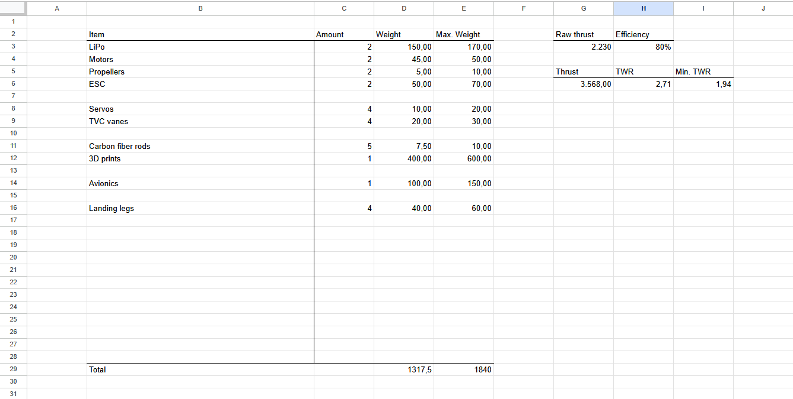

**Time spent: 1h**

## May 27 Log 2: Choosing a TVC method

I had figured out previously that I need TVC roll control and I can't just rely on throttling the motors at different speeds. Because of this the only viable options I have are using 3 or 4 TVC vanes.

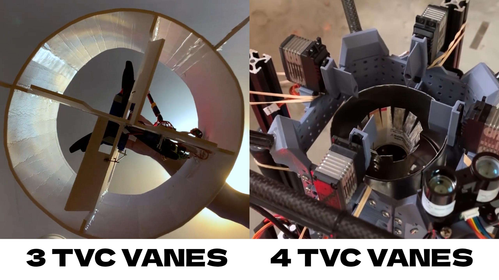

Using 3 vanes would probably be slightly cheaper. Although it would probably be fine with 3, I've decided to go with 4. The reasons are:

- 4 vanes allow me to keep all axis identical, which simplifies tuning
- 4 vanes double the control authority in the roll axis, which improves stability
- A 3 vane system needs for one vane to be longer. A longer vane would probably need hinges or supports, adding complexity.
- There are very few examples of 3 vane systems, and I haven't found any for the thrust that I'm aiming for. This makes it harder to choose servos with the right amount of torque.
- I want to keep control over the length of the vanes for balancing control authority and airflow obstruction. This is harder with a 3 vane system, as one vane has to go all across.

I don't think using 4 vanes would mean any significant cost increase, but they are simpler, they provide more control and I have more design references, so I’ve chosen to go with that.

**Time spent: 1h 30min**

## May 28: Structure and general layout

For TVC to work properly you need the thrust vector to be far away from the center of gravity (COG). You want to place all the weight at the top and TVC the bottom motor or the other way around.

A lower COG is better for stability in landings. This means I would want to place all the weight at the bottom and use TVC in the upper motor. For this, I would need a structure without walls for the air to get out. Plus, as I had figured out earlier, I probably don't want the structure to act as a duct as it can decrease performance.

My first thought was using carbon fiber rods, which I've seen being used in similar projects. After researching some other options like balsa wood, I've come to the conclusion that carbon fiber is indeed the best option. It has a much better strength to weight ratio than others, and even though it would likely need stiffeners because it can flex, what I care about is that they provide strength with the minimum amount of volume so that they don't obstruct the airflow much.

**Time spent: 1h 15min**

## May 29: Research on landing legs

In the future I might build a launchpad to launch and catch the rocket from, which means I would need landing legs that are either deployable or detachable so that they don't interfere with the launch mount.

I think deployable legs would be a better option. They would allow me to test the launch mount before trying to catch the rocket, and they could even allow me to abort a catch if any readings are off. Deployable legs are also much cooler and a nice challenge.

After looking at some other projects I've come up with a design that would be reliable and cheap and easy to implement.

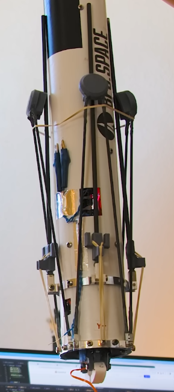

*Landing legs of the Scout F rocket by BPS.space*

Similar to the image, landing legs in my rocket would have 2 carbon fiber struts with a 3D print at the top. A single strut would be pulled by a tension spring (a rubber band in the image) and would snap into the 3D print when deployed, locking the leg in place. Landing legs would be held in place with servos before deployment.

I will go with 4 landing legs. It's what I've seen being done the most and I think it's a nice spot for stability without much weight.

**Time spent: 1h 15min**

## May 30: Starting the CAD design

Now that I know the general design and layout of the rocket, I've begun designing it in CAD. I don't know the parts that I'm going to use yet, but this model will help me refine my calculations. I'm designing for a 7" build, but if after making the CAD model and picking the parts I realize I have enough weight margin to scale down the motors or the whole vehicle, I will do that.

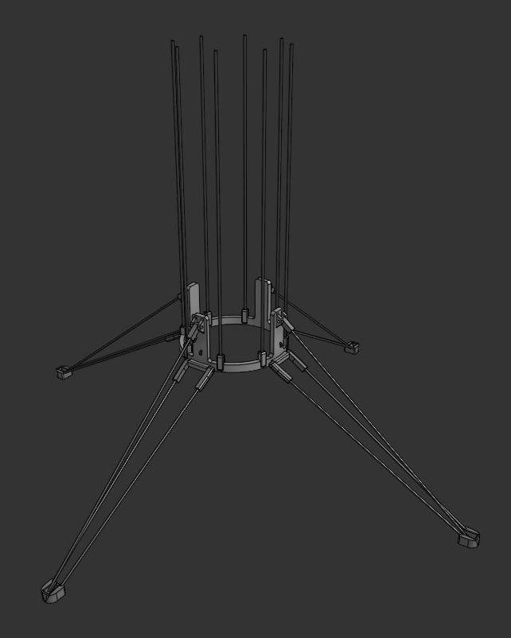

I made a new Onshape document and began designing the base of the vehicle. I've almost finished making the landing legs. Tomorrow I plan on adding the bottom motor mount and rails for integration with the launch mount.

**Time spent: 4h 30min**

## May 31: Landing legs are finished

Today I've finished making the landing legs. I've added stoppers and bolts that will allow the parts to rotate into place. 

I've also added the struts that will hold the bottom motor. These double as airflow straighteners, which probably isn't necessary. However I'm doing that on the top motor for feeding the bottom motor cleaner air, and I prefer to do it in both to ensure both motors behave the same and no torque is created.

Finally, I've began making the part that will join the bottom and top rods of the main structure. This allow me to buy shorter rods which I've seen are the cheapest option, and this also makes the rods flex less. This part will hold the servos that hold the landing legs in place too. 

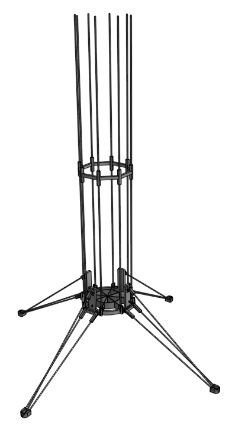

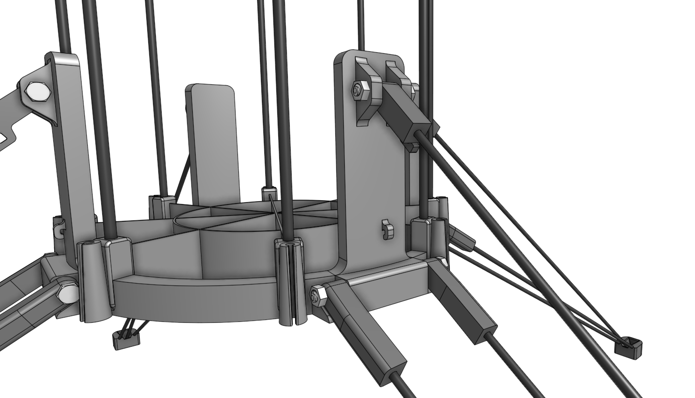

**Time spent: 4h**

## June 1: Adding servo attachments

I didn't have a lot of time today but I've figured out how to attach the servos for deploying the legs. The servos snap into some slots and are then secured with two bolts.

Now, I only have to add holes for using a zip tie to attach the two parts of each landing leg. This way both can stay in place with a single servo. With this the leg deployment mechanism would be complete.

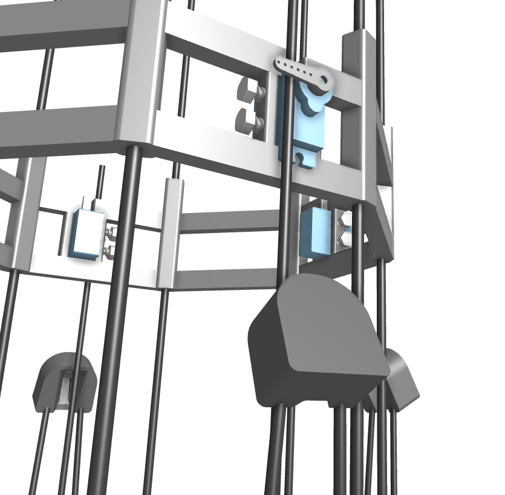

**Time spent: 2h**

## June 2: Switching to thicker rods and completing the leg deployment mechanism

I should have probably checked how much carbon fiber rods flex at different diameters before starting the CAD model. It's really bad at 3mm. I've changed most rods to 5mm which should work a lot better.

I've also redesigned the tip of the landing legs. This allows for them to be held closer to the structure before deployment, and it should also improve the reliability of the two parts of the legs locking together. I've also added a ring that attaches the two parts of landing legs, avoiding the need of using a zip tie.

With this I've finished making the leg deployment mechanism. Next, I'll make the part for holding the upper motor and TVC servos. I also plan on prototyping servo attachments soon to make sure the friction from the bolts is strong enough to hold a servo in place.

**Time spent: 2h**

## June 4: The CAD model is taking shape

Today I've made the top assembly that holds the upper motor and the 4 servos with TVC vanes. I've chosen to use Corona DS-919-MG servos, as they are fast and precise; and Emax ECO II 2807 1300KV motors, as they provide the most thrust for their range at a really affordable price too.

Next I'll make mounts for the batteries, ESCs, PCB and motors (right now they're on top of the struts and they need a mount to be screwed on). With this I should be able to slice the models to know their weight and calculate the TWR of the rocket.

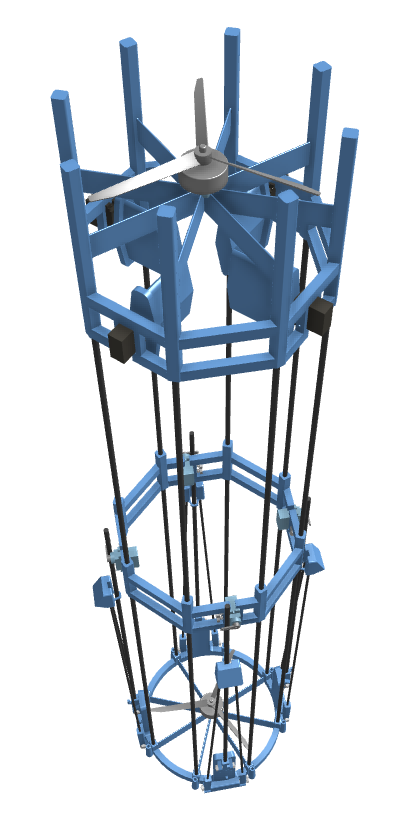

**Time spent: 3h 30min**

## June 6 Log 1: The CAD model is finished!

Today I've made the battery, ESC, PCB and motor mounts. I've also added attachments for catch pins and for securing the rocket to a test stand which I plan on using for tuning the control system.

With this the CAD model is finished. I've sliced all of the parts and determined that the TWR of the rocket is around 2. This is in the range that I was hoping for, as I want to have margin for if the rocket ends up weighing more or it produces less thrust. I will keep it at this scale and with a coaxial configuration, as it's simpler and has a similar TWR.

Next, I will do more research on batteries and ESCs to see if what I've been using for now is the best option. After this I will begin designing the avionics and prototyping mounts and attachments.

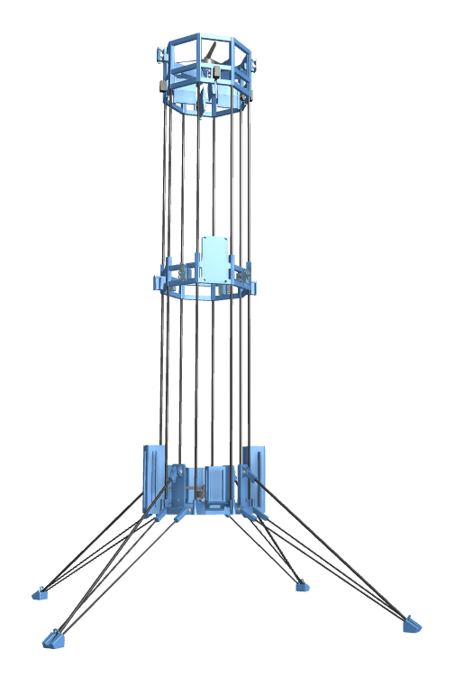

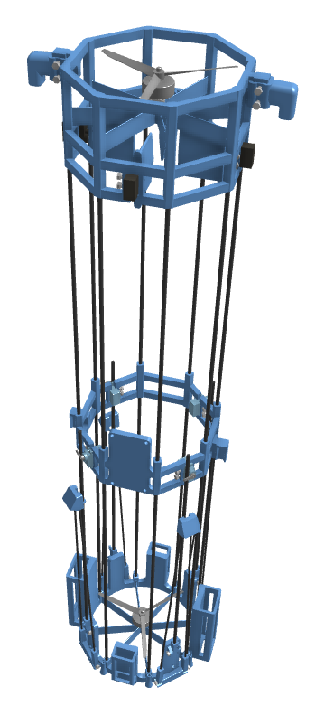

**Time spent: 4h**

## June 6 Log 2: Research on batteries and ESCs

I've decided to switch from two 3S batteries to two 6S batteries. This simplifies wiring, as I would have to find a way to connect the 3S batteries in series while keeping the cables as short as possible, as making them longer could damage the ESCs.

For the ESCs I've chosen to use the SURPASS HOBBY Flier 60A, as it's cost effective and it provides a 6V 8A output to power the rest of components.

**Time spent: 1h 30min**

## June 7: Research on avionics + beginning making the BOM and PCB

Today, I've made research on avionics components and chosen to use the following:

- **Controller**: I've chosen the ESP32 as it gives me enough processing power and built in communications
- **Altitude measurement**: I've chosen the TF-Luna LiDAR, as it's accurate and doesn't drift over time. While this sensor limits hops to up to 8 meters instead of the 10 meters I was aiming for, I think this is a fair tradeoff as upgrading to a 10 meter LiDAR would be twice as expensive.
- **Orientation**: I've chosen to go with an MPU-9250 IMU (Inertial Measurement Unit), as it's cost effective and widely used
- **Communications and data logging**: I will use Bluetooth, provided by the ESP32. I will monitor data and control the launch countdown from a laptop and the data stream will be saved on the computer.
- I will also use a voltage regulator for the LiDAR, resistors for measuring the voltage of the batteries and an LED and a buzzer for state indication

With this, I've updated the CAD model to house the new components:

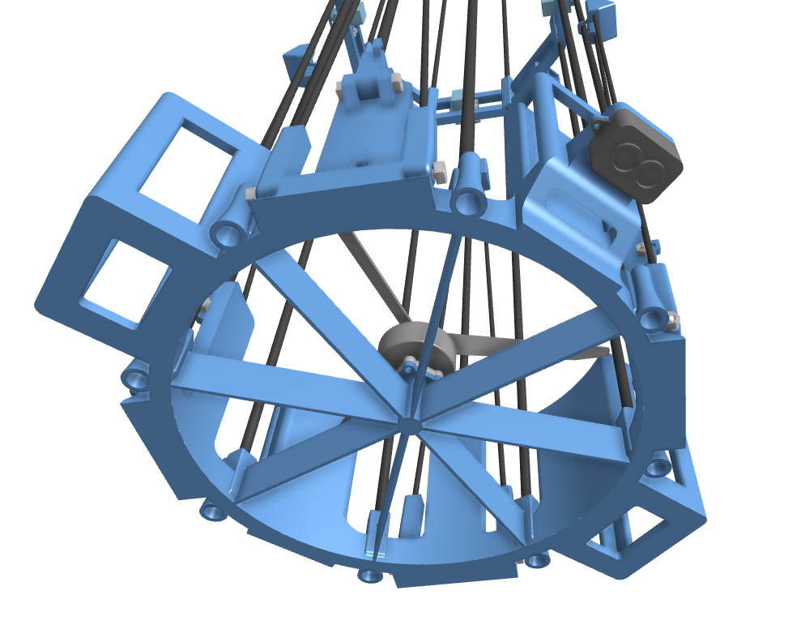

Next, I've begun making a BOM (Bill of Materials) so that I can keep track of the price and the weight of all components. I've also chosen a charger, a LiPo bag, a magnetic propeller balancer and extension cables and connectors:

Finally, I've created a new KiCAD project and I've begun making the schematic for the PCB and some custom symbols.

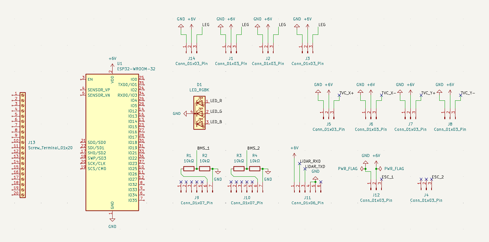

**Time spent: 7h 30min**

## June 8: Finishing the schematic

Today I’ve created custom symbols for the ESP32, the buzzer and the MPU9250. With this I’ve made all the connections and finished making the schematic. I've also realized that I can configure one ESC to use 5V instead of 6, eliminating the need to use a voltage regulator for the LiDAR. Next, I’ll create custom footprints and start making the PCB layout.

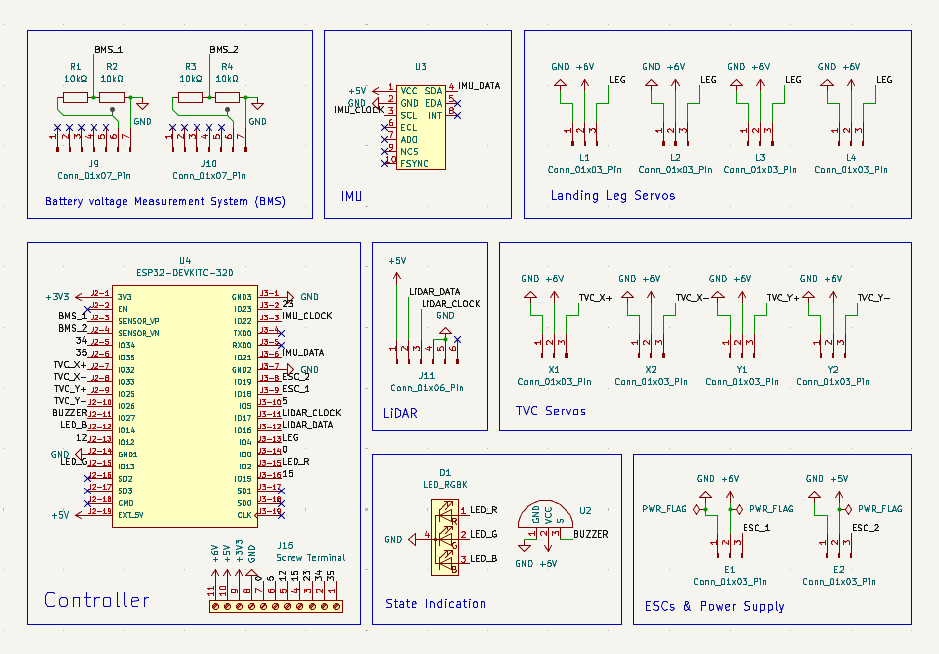

**Time spent: 5h 30min**

## June 12: Starting the PCB layout

Today I've created and downloaded most footprints and 3D models and I've placed them on the PCB layout. This is my first PCB and I really like how it's looking so far :)

Next, I'll place the missing components and models and route the remaining traces.

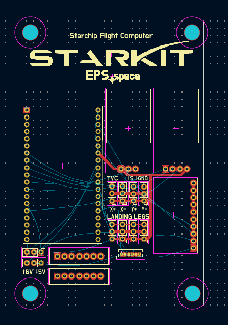

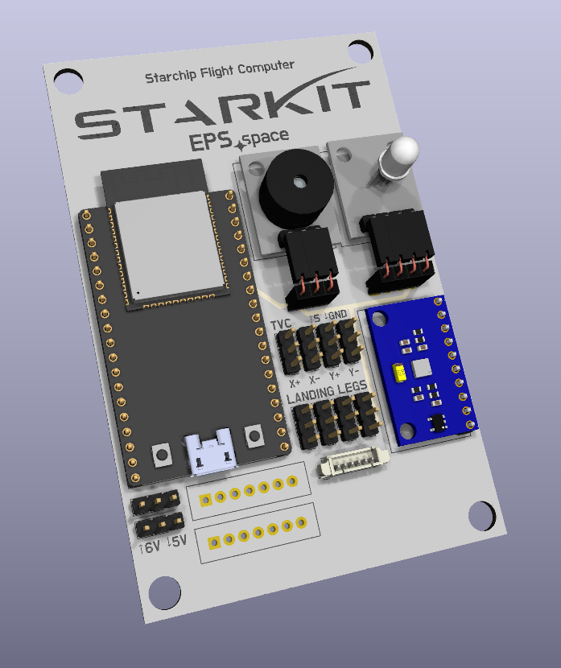

**Time spent: 6h**