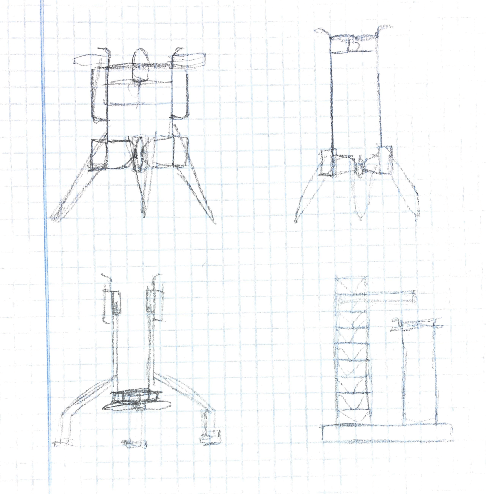
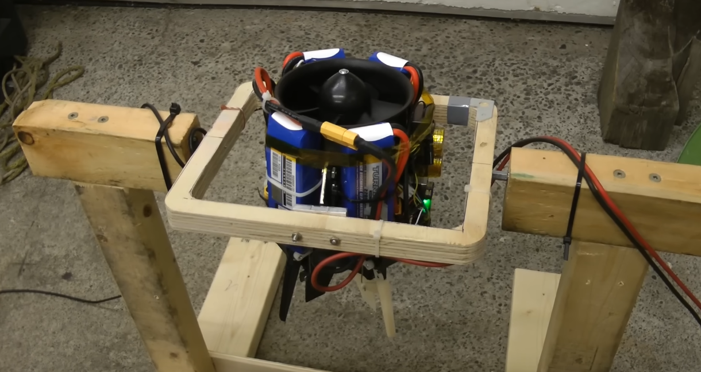
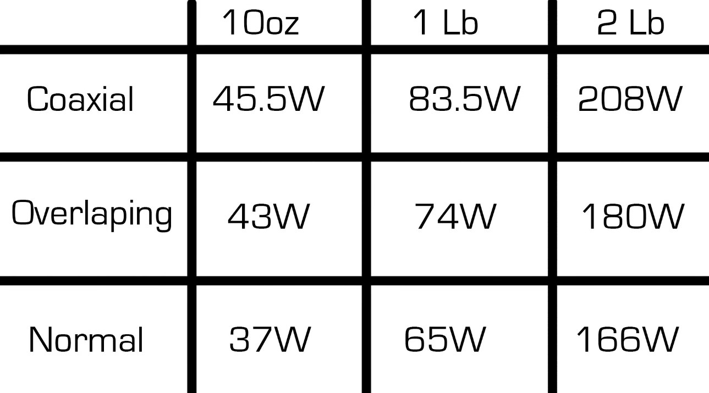
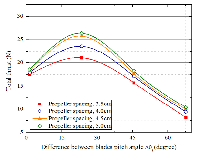

## May 22: Initial ideas and goal of the project

I always like to begin engineering projects by setting a goal. For this project, my goal is the following:
> To learn, have fun and to make something that I'm proud of by building an electric model rocket capable of lifting off, hovering and landing propulsively.

I want to build a fully reusable vehicle capable of landing propulsively through thrust vector control. If the rocket is capable of performing a 1 meter hop and hover for 30 seconds, I will consider it a success.

Based on my vision for this project, I've set some design requirements. This way, I will try to find the most efficient and cost-effective way possible of creating something that I'll be happy with:

## Design requirements
These are the absolute musts that a design should have:

- The rocket is powered by electric propulsion for cheap and safe flights and fast turnarounds
- The rocket uses thrust vectoring to lift off, hover and land propulsively
- The rocket can perform a 1 meter hop and hover for 30 seconds
- The rocket is modular
	- Components are easily accessible and replaceable
	- The rocket is designed for a future launchpad integration
	  > If I achieve reliable landings, I might try to build a launchpad to launch and catch the rocket from. The rocket should be modular and be designed with this in mind.

		- The rocket has got detachable landing legs and attachable catch pins
		- The pad should be able to hold the rocket until full throttle is reached

## Dream goals
These are not essential but they'd be cool to have:

- The rocket can perform a 10 meter hop
- The rocket can hover for a minute
- The rocket looks as cool as possible

*Initial ideas and concepts of possible designs*

**Total time spent: 1h 15min**

## May 24 Log 1: Research on propulsion systems
I've decided to choose a propulsion system first and then work around that. Some options I think would fit this project are:
- Single EDF (Electric Ducted Fan)
- Single propeller
- Counter-rotating propellers
- Ducting a propeller(s) myself

The main things I've learnt today are:
- Ducting a propeller can increase efficiency and thrust.
- EDFs take advantage of this. An added benefit is that they often have stator vanes that minimize the torque produced by spinning the propeller.
- A larger propeller is usually more efficient and provides more thrust. A larger propeller could match the thrust of a smaller EDF while being less expensive, however the torque and gyroscopic effects become greater the more you scale the propeller.
- If I use a single propeller I probably wouldn't want to duct it myself as it could actually decrease the performance (EDFs are propeller and duct combinations specifically made to work together).

I've discarded ducting a propeller myself. However, I still have to make more research to figure out what the best option is. If I manage to overcome the gyroscopic effects, a single propeller would be a nice option over an EDF, as it would be less expensive. Counter-rotating propellers would also be a good option as they cancel their torque, but I still have to research if the thrust of two propellers in series is just the sum of their individual thrust.

**Total time spent: 2h 30min**

## May 24 Log 2: Research on counter-rotating propellers

The reasons I would choose counter-rotating propellers over a single propeller are:
1. They cancel their torque, which means that they don't apply any rotational force to the vehicle and you don't have to worry about gyroscopic effects.
2. You have some control authority in the roll axis. If the rocket gains angular speed, you can correct it by adjusting the throttle of each individual motor. This also allows me to only use 2 servos for TVC, as you only need to correct 2 axis.

*The Ikarus model rocket had an issue where whenever it wanted to apply a torque through TVC, it had to apply a perpendicular torque as well due to the gyroscopic effects of a single propeller. In the Ikarus II rocket this problem was solved by using counter-rotating EDFs.*

Placing the propellers one after the other would decrease thrust and efficiency. However, if I keep the propellers spaced and use airflow straighteners for feeding the second propeller cleaner air, this could be mitigated.

*Test on the efficiency of normal, overlapping and coaxial propellers. Coaxial propellers are about 80% of the efficiency at a low spacing. Source: https://www.youtube.com/watch?v=tFJyE3Uns3o*

If I want to get as much thrust as possible in this configuration, I should use a higher pitch in the rear propeller. However, I don't think this is a good idea as there aren't many high pitch propeller options or test data, and using different propellers might cause them to rotate at different speeds, which could cause a torque in the vehicle.

I'll have to do more research to figure this out, nonetheless I think counter-rotating propellers are a really good option.

*Test showing the thrust of different propeller spacings and rear propeller pitch difference. Source: https://www.icas.org/icas_archive/ICAS2014/data/papers/2014_0072_paper.pdf According to https://drones.stackexchange.com/questions/1209/do-propellers-layered-on-top-of-each-other-have-twice-the-thrust-of-one-propelle, you can get almost the full thrust if you increase the pitch of the rear propeller.*

**Time spent: 1h 30min**

## May 25: Deciding on counter-rotating propellers

https://www.youtube.com/watch?v=VsyFejn40Ss

This video shows a vehicle with a similar configuration to what I was thinking. However, TVC roll control is later added because adjusting the throttle of each motor is not enough and causes the rocket to lose thrust.

I could test the thrust of the motors at different throttle levels to try and avoid this, but either way I think adding TVC roll control would be better. In the future the rocket could need precise roll control if I attempt to build a catch tower.

After some research I’ve decided that using two identical counter-rotating motors and propellers is the best option. You avoid torque and gyroscopic effects that you would have with a single propeller or EDF, and you still can get their full efficiency by placing them side by side. However, I'll have to see if even with the structural weight that would add placing the propellers side by side, this configuration would outperform placing the propellers one after the other.

**Time spent: 1h**

## May 27 Log 1: Deciding a motor configuration

I've made a spreadsheet for calculating the Thrust to Weight Ratio (TWR) of a coaxial and a side by side configuration. 

For the coaxial configuration, I'm picturing a cylindrical structure with a propeller at the top and another at the bottom. For the side by side configuration, I'm thinking of 2 of such structures next to each other, with one propeller each.

For the calculations I've used a carbon fiber rod structure, 4 TVC vanes and 2 Emax ECO II 2807 motors with 7" propellers. I will have to research more in depth if these options are the best for the project, but so far the coaxial configuration has a better TWR.

There are many variables that I won't know until I pick all the parts and design the 3D models. The calculations will get more accurate as I do so, but for now I will be designing the rocket for a coaxial configuration.

**Time spent: 1h**

## May 27 Log 2: Choosing a TVC method

I had figured out previously that I need TVC roll control and I can't just rely on throttling the motors at different speeds. Because of this the only viable options I have are: 
- 3 TVC vanes
- 4 TVC vanes

3 vanes would probably be a bit cheaper. However, the servo controlling the bigger vane would likely need more torque and I would have less roll control authority, too. I would probably need to add some kind of hinge or support as well when making a vane this long.

Although it would probably be fine with 3 vanes, I will go with 4 as I prefer to keep all axis identical and to base my design on something that's been done by many more people.

**Time spent: 1h 15min**