## May 22: Initial ideas and goal of the project

I always like to begin engineering projects by setting a goal. For this project, my goal is the following:

**To learn and have fun by building an electric model rocket capable of lifting off, hovering and landing propulsively**

I want to build a fully reusable vehicle capable of landing propulsively through thrust vector control. If the rocket is capable of performing a 1 meter hop and hover for 30 seconds, I will consider it a success.

Based on my vision for this project, I've set some design requirements. This way, I will try to find the most efficient and cost-effective way possible of creating something that I'll be happy with:

### Design requirements

These are the absolute musts that a design should have:

- The rocket is powered by electric propulsion for cheap and safe flights and fast turnarounds
- The rocket is fully reusable and uses thrust vectoring to lift off, hover and land propulsively
- The rocket can perform a 1 meter hop and hover for 30 seconds
- The rocket is modular

  - Components are easily accessible and replaceable
  - The rocket is designed for a future launchpad integration

    _If I achieve reliable landings, I might try to build a launchpad to launch and catch the rocket from. The rocket should be modular and be designed with this in mind._

    - The rocket has got detachable or deployable landing legs and attachable catch pins
    - The pad should be able to hold the rocket until full throttle is reached

### Dream goals

These are not essential but they'd be cool to have:

- The rocket can perform a 10 meter hop
- The rocket can hover for a minute
- The rocket looks as cool as possible

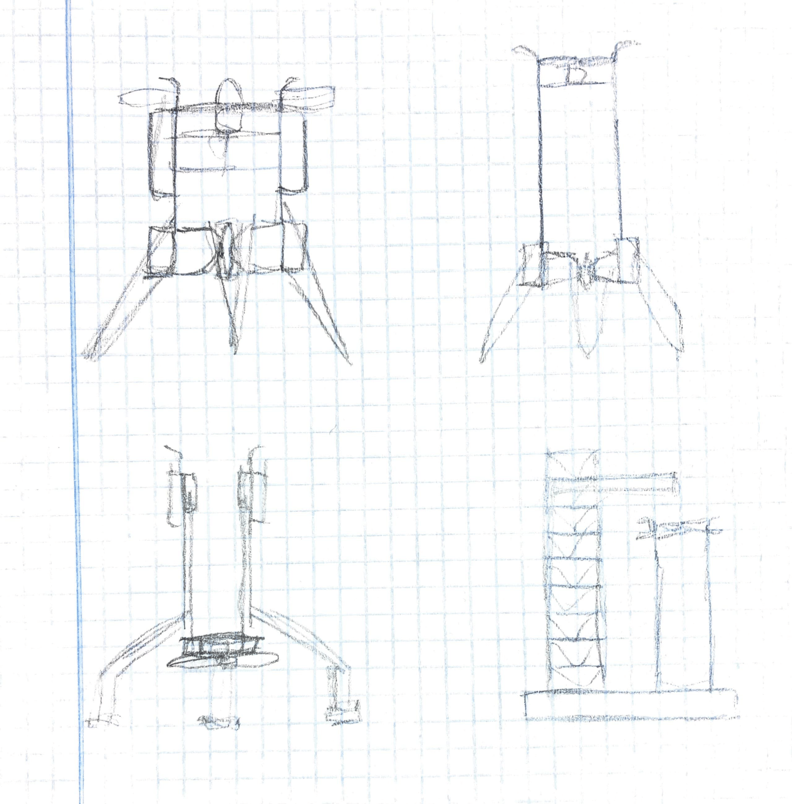

_Initial ideas and concepts of possible designs_

**Time spent: 1h 15min**

## May 24 Log 1: Research on propulsion systems

I've decided to choose a propulsion system first and then work around that. Some options I think would fit this project are:

- Single EDF (Electric Ducted Fan)
- Single propeller
- Counter-rotating propellers
- Ducting a propeller(s) myself

The main things I've learnt today are:

- Ducting a propeller can increase efficiency and thrust.
- EDFs take advantage of this. An added benefit is that they often have stator vanes that minimize the torque produced by spinning the propeller.
- A larger propeller is usually more efficient and provides more thrust. A larger propeller could match the thrust of a smaller EDF while being less expensive, however the torque and gyroscopic effects become greater the more you scale the propeller.
- If I use a single propeller I probably wouldn't want to duct it myself as it could actually decrease the performance (EDFs are propeller and duct combinations specifically made to work together).

I've discarded ducting a propeller myself. However, I still have to make more research to figure out what the best option is. If I manage to overcome the gyroscopic effects, a single propeller would be a nice option over an EDF, as it would be less expensive. Counter-rotating propellers would also be a good option as they cancel their torque, but I still have to research if the thrust of two propellers in series is just the sum of their individual thrust.

**Time spent: 2h 30min**

## May 24 Log 2: Research on counter-rotating propellers

The reasons I would choose counter-rotating propellers over a single propeller are:

1. They cancel their torque, which means that they don't apply any rotational force to the vehicle and you don't have to worry about gyroscopic effects.
2. You have some control authority in the roll axis. If the rocket gains angular speed, you can correct it by adjusting the throttle of each individual motor. This also allows me to only use 2 servos for TVC, as you only need to correct 2 axis.

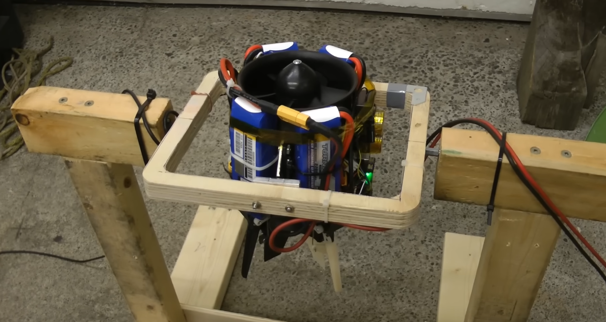

_The Ikarus model rocket had an issue where whenever it wanted to apply a torque through TVC, it had to apply a perpendicular torque as well due to the gyroscopic effects of a single propeller. In the Ikarus II rocket this problem was solved by using counter-rotating EDFs._

Placing the propellers one after the other would decrease thrust and efficiency. However, if I keep the propellers spaced and use airflow straighteners for feeding the second propeller cleaner air, this could be mitigated.

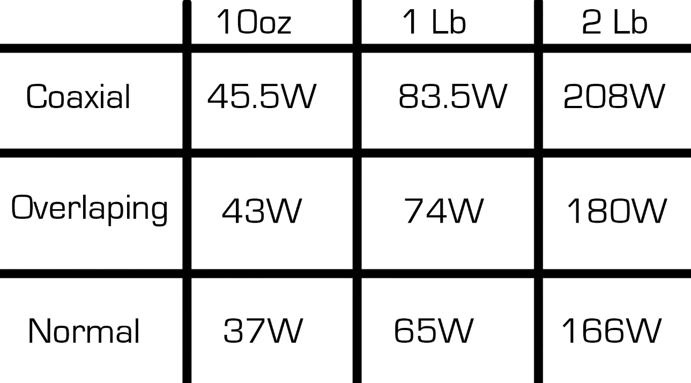

_Test on the efficiency of normal, overlapping and coaxial propellers. Coaxial propellers are about 80% of the efficiency at a low spacing. Source: https://www.youtube.com/watch?v=tFJyE3Uns3o_

If I want to get as much thrust as possible in this configuration, I should use a higher pitch in the rear propeller. However, I don't think this is a good idea as there aren't many high pitch propeller options or test data, and using different propellers might cause them to rotate at different speeds, which could cause a torque in the vehicle.

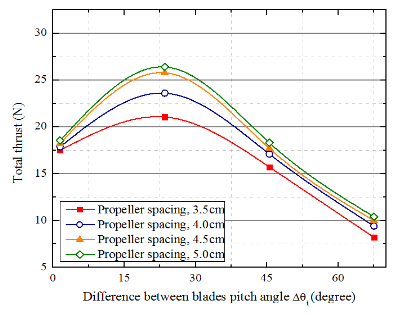

_Test showing the thrust of different propeller spacings and rear propeller pitch difference. Source: https://www.icas.org/icas_archive/ICAS2014/data/papers/2014_0072_paper.pdf According to https://drones.stackexchange.com/questions/1209/do-propellers-layered-on-top-of-each-other-have-twice-the-thrust-of-one-propelle, you can get almost the full thrust if you increase the pitch of the rear propeller._

I'll have to do more research to figure this out, nonetheless I think counter-rotating propellers are a really good option.

**Time spent: 1h 30min**

## May 25: Deciding on counter-rotating propellers

After some research I’ve decided that using two identical counter-rotating motors and propellers is the best option. You avoid torque and gyroscopic effects that you would have with a single propeller or EDF, and you still can get their full efficiency by placing them side by side. However, I'll have to see if even with the structural weight that would add placing the propellers side by side, this configuration would outperform placing the propellers one after the other.

https://www.youtube.com/watch?v=VsyFejn40Ss

This video shows a vehicle with a similar configuration to what I was thinking. However, TVC roll control is later added because adjusting the throttle of each motor is not enough and causes the rocket to lose thrust.

I could test the thrust of the motors at different throttle levels to try and avoid this, but either way I think adding TVC roll control would be better. In the future the rocket could need precise roll control if I attempt to build a catch tower.

**Time spent: 1h**

## May 27 Log 1: Deciding a motor configuration

I've made a spreadsheet for calculating the thrust to weight ratio (TWR) of a coaxial and a side by side configuration.

For the coaxial configuration, I'm picturing a cylindrical structure with a propeller at the top and another at the bottom. For the side by side configuration, I'm thinking of 2 of such structures next to each other, with one propeller each. Note that this isn't necessarily the only way of placing the propellers one next to the other, but I want to keep a shape that can integrate nicely with a launch mount and a catch tower.

For the calculations I've used a carbon fiber rod structure, 4 TVC vanes and 2 Emax ECO II 2807 motors with 7" propellers. I will have to research more in depth if these options are the best for the project, but so far the coaxial configuration has a better TWR.

There are many variables that I won't know until I pick all the parts and design the 3D models. The calculations will get more accurate as I do so, but for now I will be designing the rocket for a coaxial configuration.
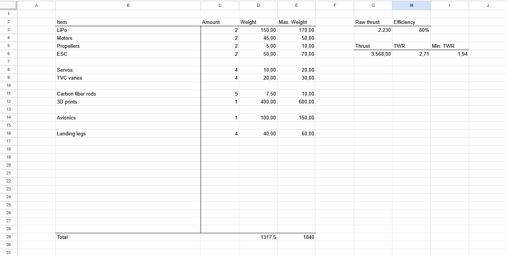

**Time spent: 1h**

## May 27 Log 2: Choosing a TVC method

I had figured out previously that I need TVC roll control and I can't just rely on throttling the motors at different speeds. Because of this the only viable options I have are using 3 or 4 TVC vanes.

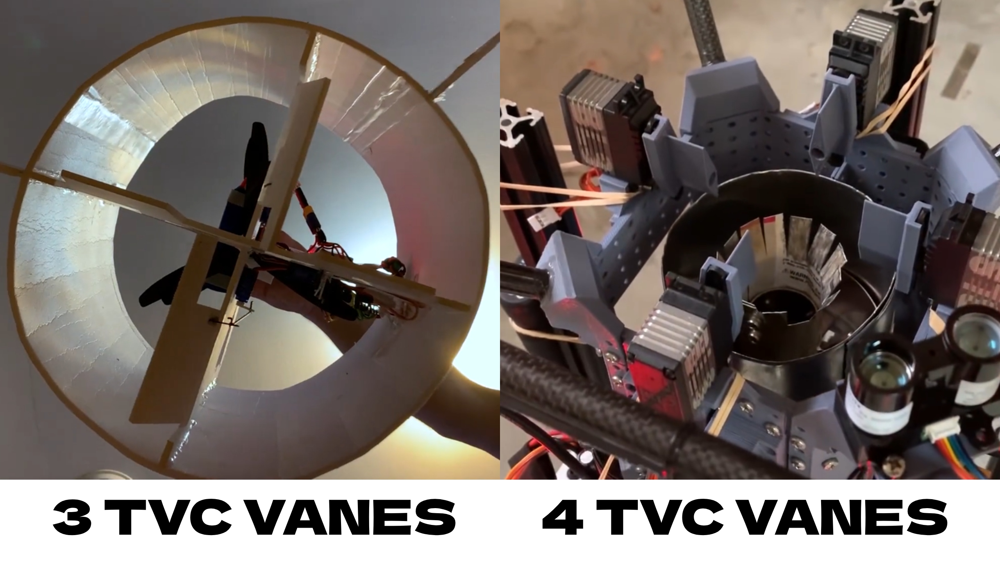

Using 3 vanes would probably be slightly cheaper. Although it would probably be fine with 3, I've decided to go with 4. The reasons are:

- 4 vanes allow me to keep all axis identical, which simplifies tuning
- 4 vanes double the control authority in the roll axis, which improves stability
- A 3 vane system needs for one vane to be longer. A longer vane would probably need hinges or supports, adding complexity.
- There are very few examples of 3 vane systems, and I haven't found any for the thrust that I'm aiming for. This makes it harder to choose servos with the right amount of torque.
- I want to keep control over the length of the vanes for balancing control authority and airflow obstruction. This is harder with a 3 vane system, as one vane has to go all across.

I don't think using 4 vanes would mean any significant cost increase, but they are simpler, they provide more control and I have more design references, so I’ve chosen to go with that.

**Time spent: 1h 30min**

## May 28: Structure and general layout

For TVC to work properly you need the thrust vector to be far away from the center of gravity (COG). You want to place all the weight at the top and TVC the bottom motor or the other way around.

A lower COG is better for stability in landings. This means I would want to place all the weight at the bottom and use TVC in the upper motor. For this, I would need a structure without walls for the air to get out. Plus, as I had figured out earlier, I probably don't want the structure to act as a duct as it can decrease performance.

My first thought was using carbon fiber rods, which I've seen being used in similar projects. After researching some other options like balsa wood, I've come to the conclusion that carbon fiber is indeed the best option. It has a much better strength to weight ratio than others, and even though it would likely need stiffeners because it can flex, what I care about is that they provide strength with the minimum amount of volume so that they don't obstruct the airflow much.

**Time spent: 1h 15min**

## May 29: Research on landing legs

In the future I might build a launchpad to launch and catch the rocket from, which means I would need landing legs that are either deployable or detachable so that they don't interfere with the launch mount.

I think deployable legs would be a better option. They would allow me to test the launch mount before trying to catch the rocket, and they could even allow me to abort a catch if any readings are off. Deployable legs are also much cooler and a nice challenge.

After looking at some other projects I've come up with a design that would be reliable and cheap and easy to implement.

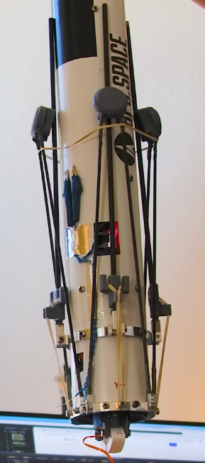

_Landing legs of the Scout F rocket by BPS.space_

Similar to the image, landing legs in my rocket would have 2 carbon fiber struts with a 3D print at the top. A single strut would be pulled by a tension spring (a rubber band in the image) and would snap into the 3D print when deployed, locking the leg in place. Landing legs would be held in place with servos before deployment.

I will go with 4 landing legs. It's what I've seen being done the most and I think it's a nice spot between stability and weight.

**Time spent: 1h 15min**

## May 30: Starting the CAD design

Now that I know the general design and layout of the rocket, I've begun designing it in CAD. I don't know the parts that I'm going to use yet, but this model will help me refine my calculations. I'm designing for a 7" build, but if after making the CAD model and picking the parts I realize I have enough weight margin to scale down the motors or the whole vehicle, I will do that.

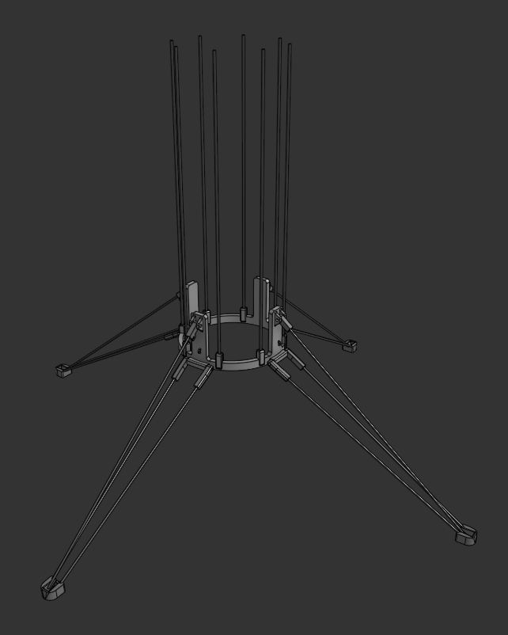

I made a new Onshape document and began designing the base of the vehicle. I've almost finished making the landing legs. Tomorrow I plan on adding the bottom motor mount and rails for integration with the launch mount.

**Time spent: 4h 30min**

## May 31: Landing legs are finished

Today I've finished making the landing legs. I've added stoppers and bolts that will allow the parts to rotate into place.

I've also added the struts that will hold the bottom motor. These double as airflow straighteners, which probably isn't necessary. However I'm doing that on the top motor for feeding the bottom motor cleaner air, and I prefer to do it in both to ensure both motors behave the same and no torque is created.

Finally, I've begun making the part that will join the bottom and top rods of the main structure. This allows me to buy shorter rods which I've seen are the cheapest option, and this also makes the rods flex less. This part will hold the servos that hold the landing legs in place too.

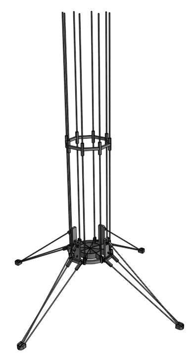

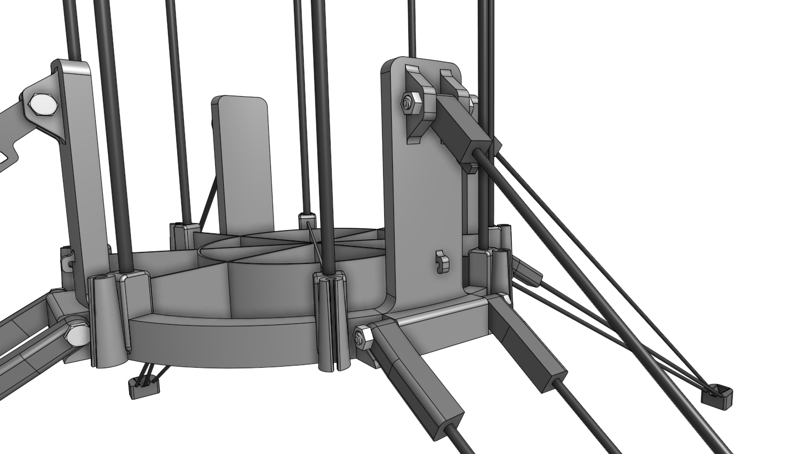

**Time spent: 4h**

## June 1: Adding servo attachments

I didn't have a lot of time today but I've figured out how to attach the servos for deploying the legs to the 3D printed part. The servos snap into some slots and are then secured with two bolts.

Now, I only have to add holes to the landing pads for using a zip tie to attach the two parts of each landing leg. This way both can stay in place with a single servo. With this the leg deployment mechanism would be complete.

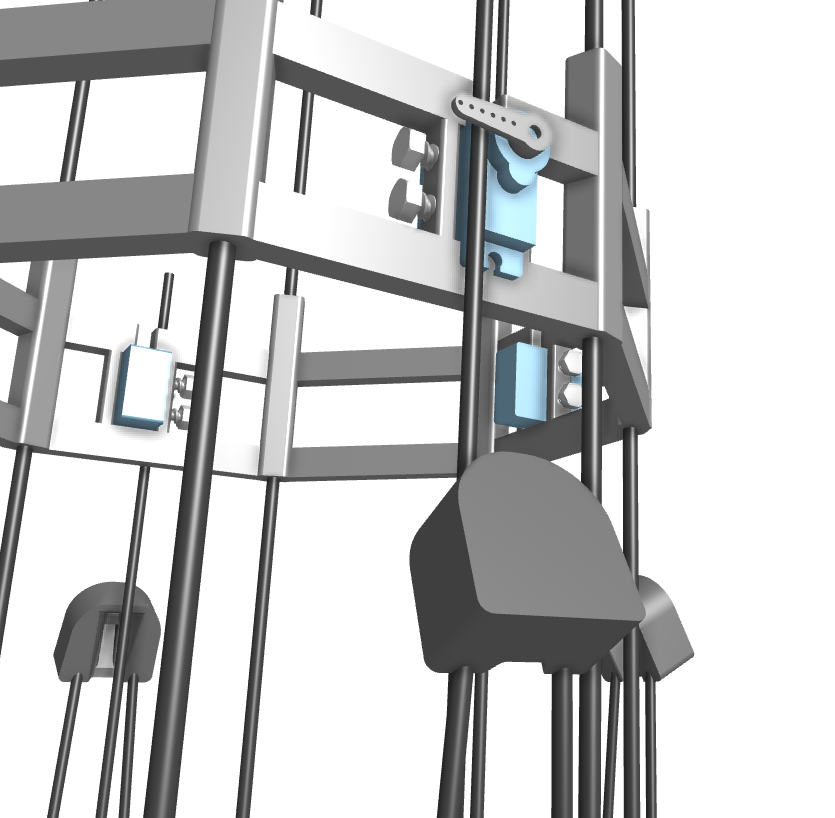

**Time spent: 2h**

## June 2: Switching to thicker rods and completing the leg deployment mechanism

I should have probably checked how much carbon fiber rods flex at different diameters before starting the CAD model. It's really bad at 3mm. I've changed most rods to 5mm which should work a lot better.

I've also redesigned landing pads. This allows for them to be held closer to the structure before deployment, and it should also improve the reliability of the two parts of the legs locking together. I've also added a ring that attaches the two parts of landing legs, avoiding the need of using a zip tie.

With this I've finished making the leg deployment mechanism. Next, I'll make the part for holding the upper motor and TVC servos.

**Time spent: 2h**

## June 4: The CAD model is taking shape

Today I've made the top assembly that holds the upper motor and the 4 servos with TVC vanes. I've chosen to use Corona DS-919-MG servos, as they are fast and precise; and Emax ECO II 2807 1300KV motors, as they provide the most thrust for their range at a really affordable price too.

Next I'll make mounts for the batteries, ESCs, PCB and motors (right now they're on top of the struts and they need a mount to be screwed on). With this I should be able to slice the models to know their weight and calculate the TWR of the rocket.

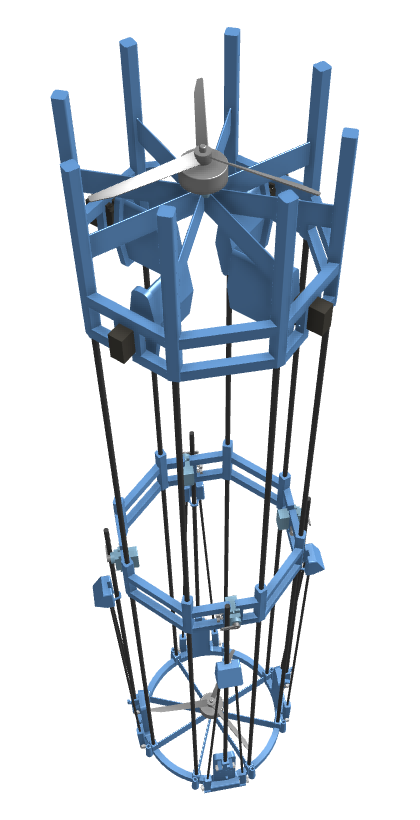

**Time spent: 3h 30min**

## June 6 Log 1: The CAD model is finished!

Today I've made the battery, ESC, PCB and motor mounts. I've also added attachments for catch pins and for securing the rocket to a test stand which I plan on using for tuning the control system.

With this the CAD model is finished. I've sliced all of the parts and determined that the TWR of the rocket is around 2. This is in the range that I was hoping for, as I want to have margin for if the rocket ends up weighing more or it produces less thrust. I will keep it at this scale and with a coaxial configuration, as it's simpler and has a similar TWR.

Next, I will do more research on batteries and ESCs to see if what I've been using for now is the best option. After this I will begin designing the avionics and prototyping mounts and attachments.

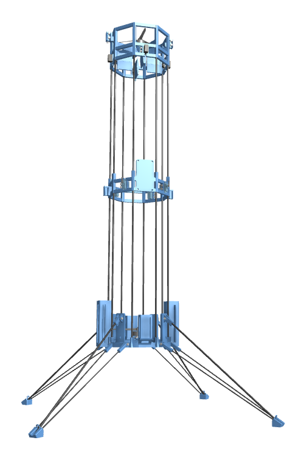

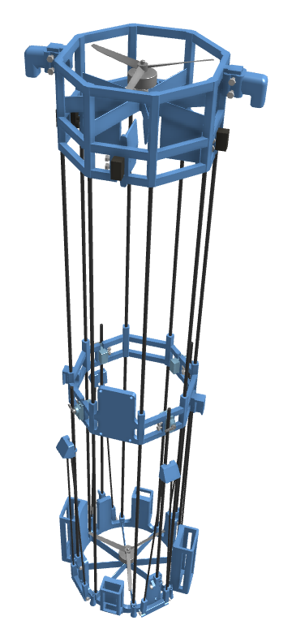

**Time spent: 4h**

## June 6 Log 2: Research on batteries and ESCs

I've decided to switch from two 3S batteries to two 6S batteries. This simplifies wiring, as I would have to find a way to connect the 3S batteries in series while keeping the cables as short as possible, as making them longer could damage the ESCs.

For the ESCs I've chosen to use the SURPASS HOBBY Flier 60A, as it's cost effective and it provides a 6V 8A output to power the rest of components.

**Time spent: 1h 30min**

## June 7: Research on avionics + beginning making the BOM and PCB

Today, I've made research on avionics components and chosen to use the following:

- **Controller**: I've chosen the ESP32 as it gives me enough processing power and built in communications
- **Altitude measurement**: I've chosen the TF-Luna LiDAR, as it's accurate and doesn't drift over time. While this sensor limits hops to up to 8 meters instead of the 10 meters I was aiming for, I think this is a fair tradeoff as upgrading to a 10 meter LiDAR would be twice as expensive.
- **Orientation**: I've chosen to go with an MPU-9250 IMU (Inertial Measurement Unit), as it's cost effective and widely used
- **Communications and data logging**: I will use Bluetooth, provided by the ESP32. I will monitor data and control the launch countdown from a laptop and the data stream will be saved on the computer.
- I will also use a voltage regulator for the LiDAR, resistors for measuring the voltage of the batteries and an LED and a buzzer for state indication

With this, I've updated the CAD model to house the new components:

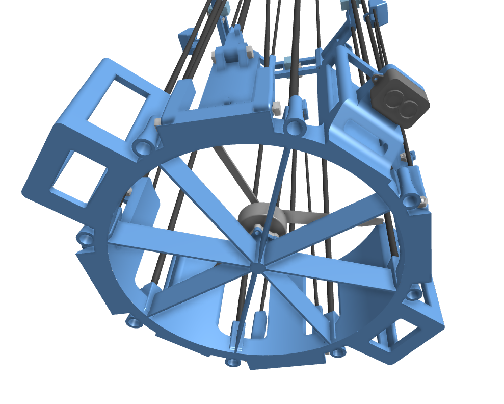

Next, I've begun making a BOM so that I can keep track of the price and the weight of all components. I've also chosen a charger, a LiPo bag, a magnetic propeller balancer and extension cables and connectors:

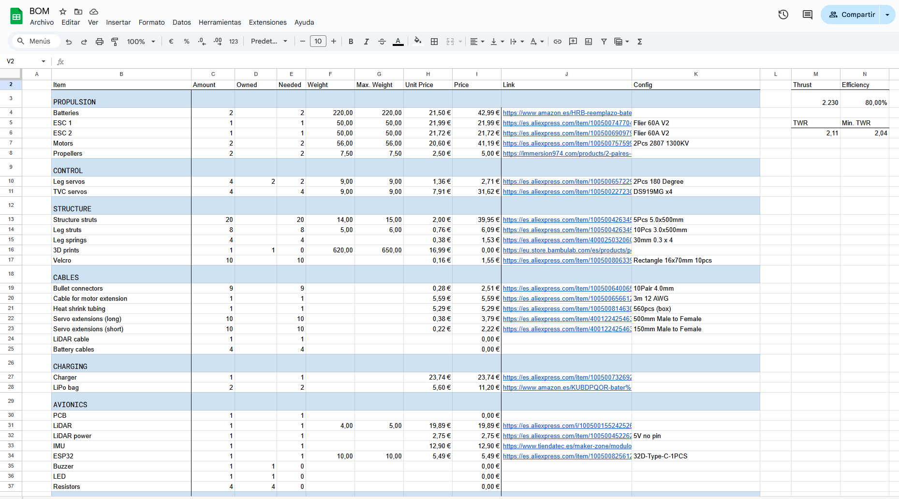

Finally, I've created a new KiCAD project and I've begun making the schematic for the PCB and some custom symbols.

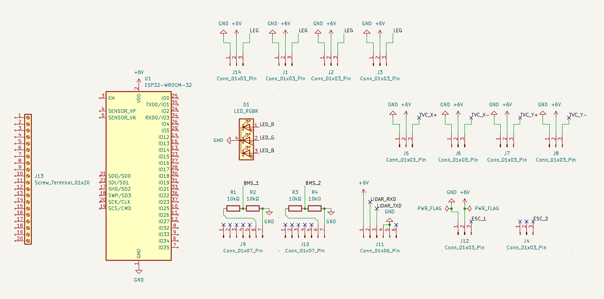

**Time spent: 7h 30min**

## June 8: Finishing the schematic

Today I’ve created custom symbols for the ESP32, the buzzer and the MPU9250. With this I’ve made all the connections and finished making the schematic. I've also realized that I can configure one ESC to use 5V instead of 6, eliminating the need to use a voltage regulator for the LiDAR. Next, I’ll create custom footprints and start making the PCB layout.

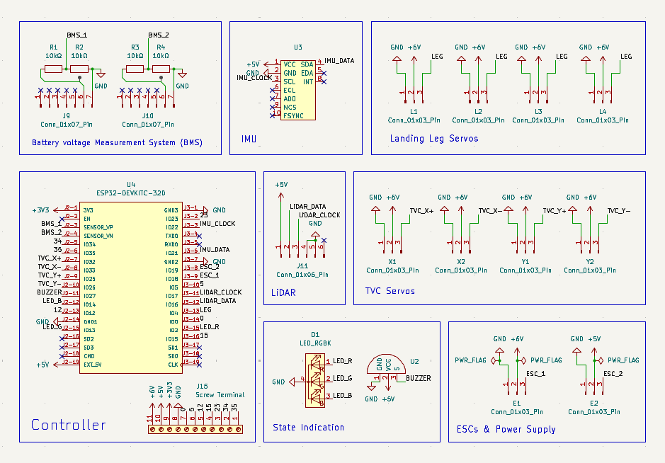

**Time spent: 5h 30min**

## June 12: Starting the PCB layout

Today I've created or downloaded most footprints and 3D models and I've placed them on the PCB layout. This is my first PCB and I really like how it's looking so far. Next, I'll place the missing components and models and route the remaining traces.

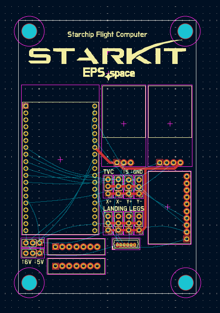

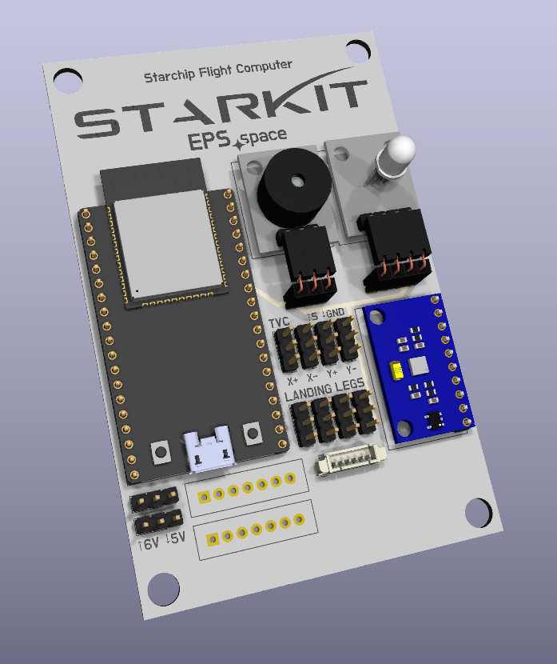

**Time spent: 6h**

## June 13: Finishing the PCB

Today I've finished making and downloading the remaining footprints and 3D models, arranging the components on the PCB, routing the remaining traces and making the silkscreen. With this the PCB is complete!

Next, I'll finish the BOM and revise all components. After that I will send my project to online forums to make sure I haven't done any mistakes and that I have the most chances of succeeding.

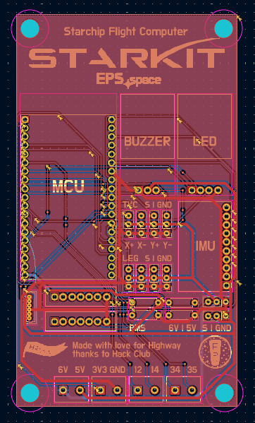

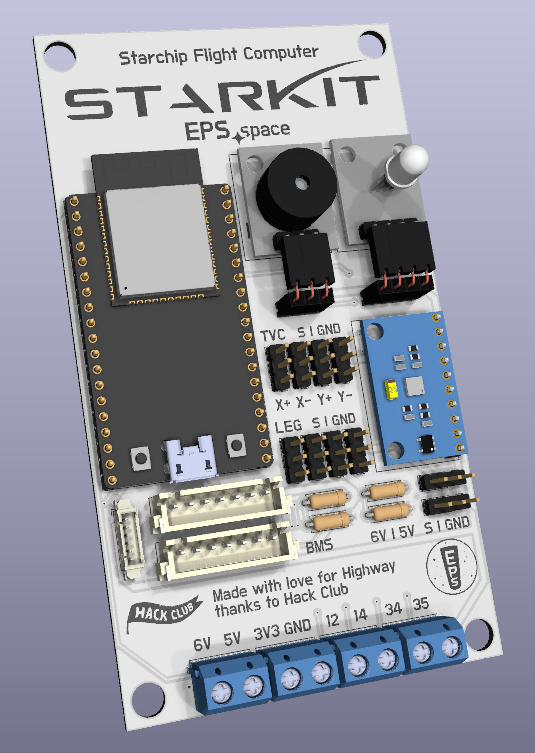

**Time spent: 5h**

## June 14: Making a Unity simulation

My Internet decided not to work today so I started making a Unity simulation to better understand how the flight software would work. In the simulation, the rocket is capable of holding a predefined altitude and correcting its orientation with only the data that the real flight computer would have.

The following days I will work on the BOM and I’ll continue with the simulation after getting the project approved.

(Screenshot coming whenever I restore my Internet)

**Time spent: 3h**

## June 15 to 19: Updating the BOM

Over the past few days I've revised every component of the BOM and added some that were missing. I've gone through every component, searched for cheaper and better alternatives, and I've updated their weight and price. I've ended up switching a few connectors, so I will have to update that in the PCB as well. My Internet is still dead on my main PC so I will update the components and reroute the traces as soon as I can.

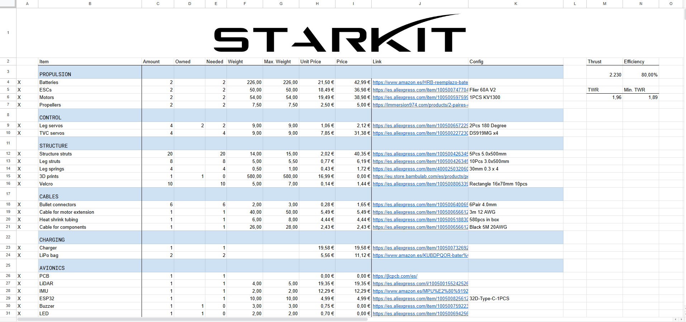

**Time spent: 10h 45min across all days**

## June 21: Updating the PCB

In a combination of luck, hours of troubleshooting and miraculous circumstances I've managed to restore Internet connection on my main PC at about 1kbps. I've sent the KiCad files to my email and managed to open them on another computer.

After that I've updated the connectors that I had changed and I've rerouted the traces. Not only does the new design look nicer but it also has enough space to fit a picture of a silly kitten (the name "Starkit" comes from my obsession with cats anyways). I have also exported the PCB 3D model and attached it to its mount in the CAD model.

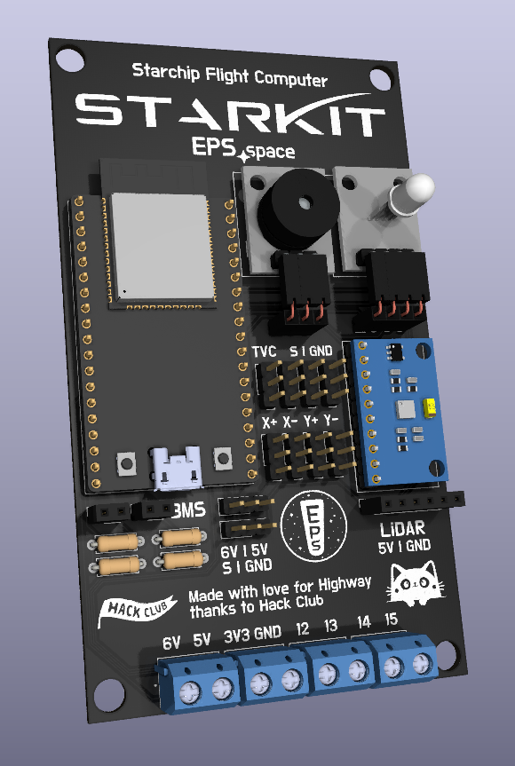

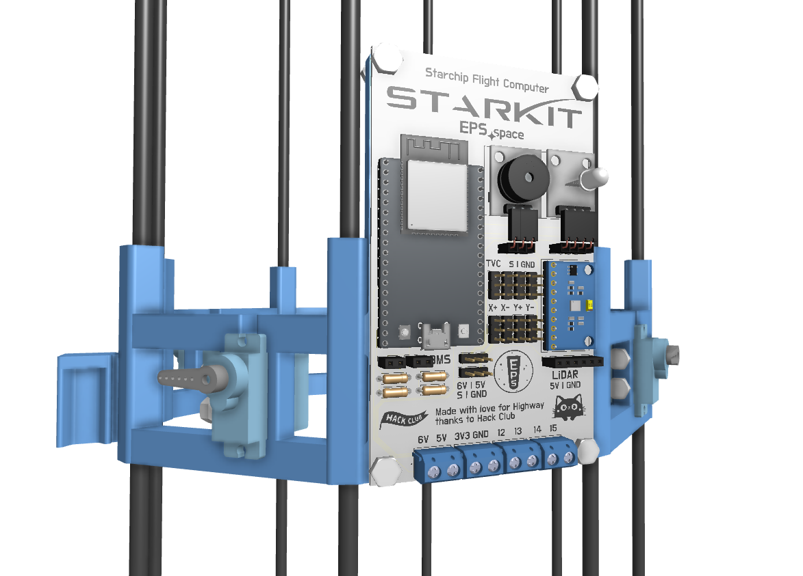

**Time spent: 4h 30min**

## June 22: Tweaks to the CAD model and asking for design feedback

Today I've updated the CAD model slightly by adding bolts to lock carbon fiber rods to 3D prints, eliminating the need for glue. This should allow me to more easily replace rods or 3D printed parts when they break.

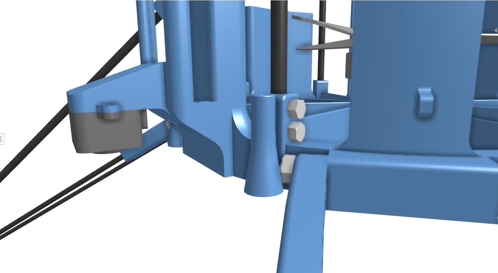

After that I've written about the design of the rocket and asked for feedback on RC Groups, where there are people much more experienced than me that actually know what they're doing. With this I hope to make sure that I didn't make any major design flaw and that I have the most chances of succeeding.

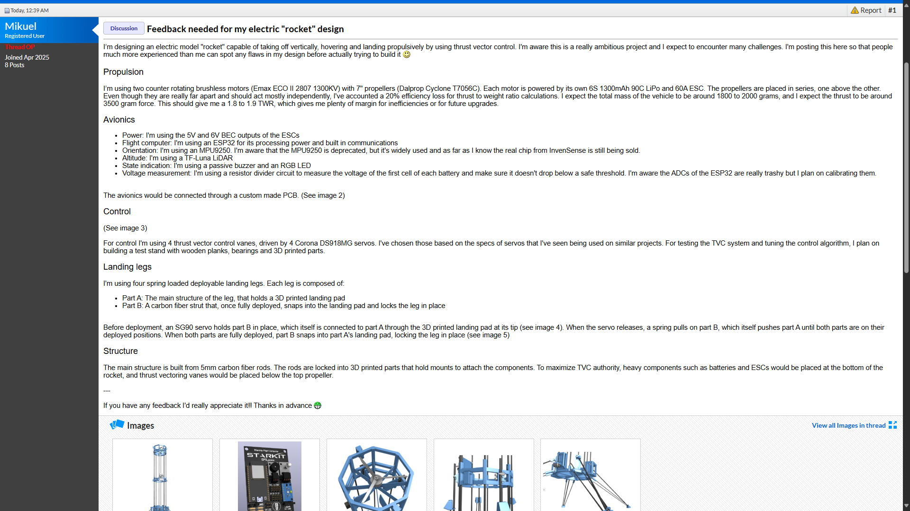

**Time spent: 3h 30min**

## June 23: Preparations for submitting

People in RC Groups haven't spotted any major design flaws so far, so today I have started preparing my project for submission!

First, I have converted the BOM to CSV format and uploaded it to the project repo. Next, I have moved all of the PCB dependencies to a single folder and uploaded the KiCAD project to GitHub as well. Finally, I have updated the README following all of the submission requirements, including making a wiring diagram:

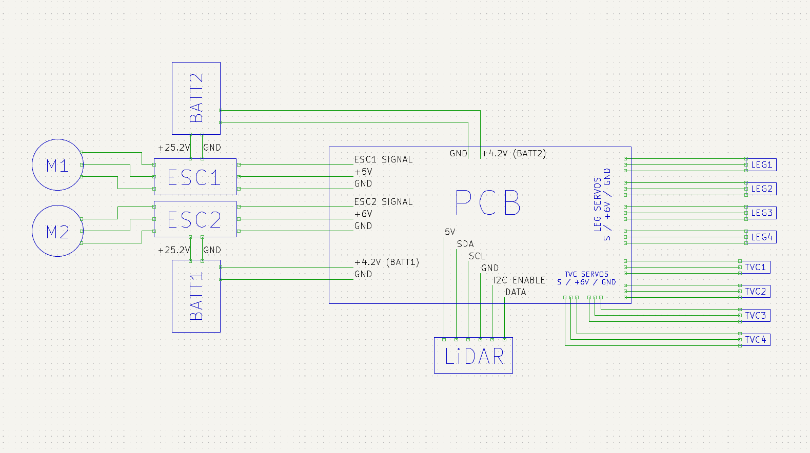

Finally, I have posted the project in #highway-pitstop and I'll see how it goes!

**Time spent: 3h**

---

# After getting approved

## July 3: Buying the parts!

I've got approved and I've just received the grant! Today I've checked which parts I could buy and receive in time before my trip and I've ended up buying the batteries and the LiPo bags.

**Time spent: 1h**

## July 4 to 6: The first parts have arrived

Over the past few days I've received the batteries and LiPo bags and I've uploaded their receipts to HCB!

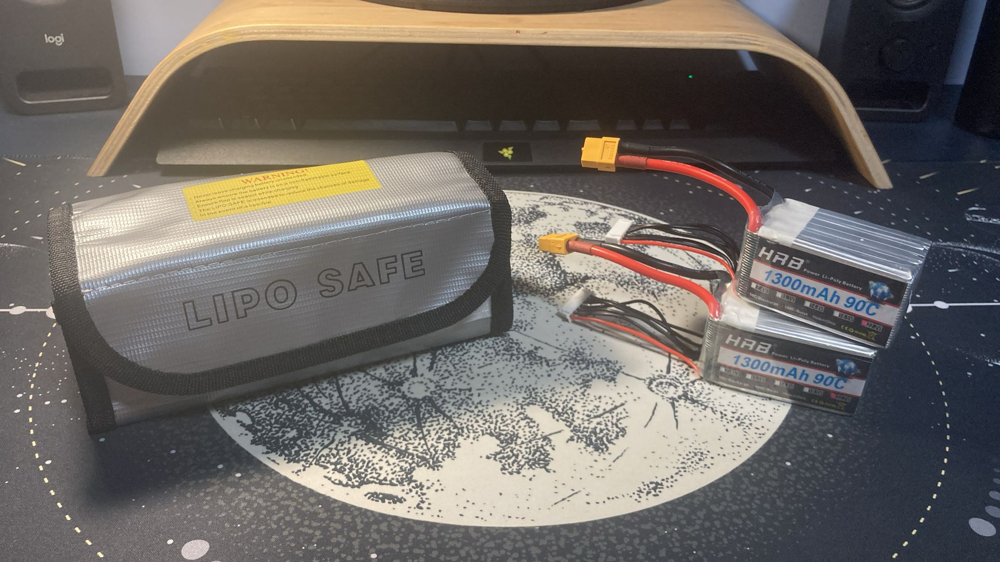

## July 8: Prototyping servo mounts

Today I printed the landing leg servo mounts to see how they would behave.

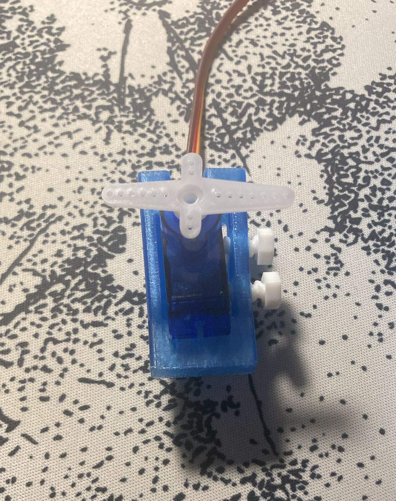

Turns out, not really great. I was hoping for the friction from the bolts to prevent the servo from slipping, but this is not the case. In this prototype, the print can bend slightly, which wouldn't happen in the real thing, potentially increasing the friction. However, I've decided to redesign the servo mounts to make sure the servo will stay securely in place.

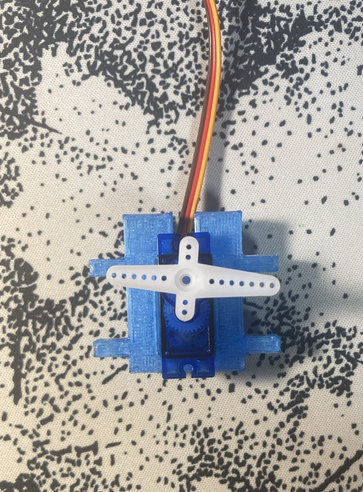

In the new design, the servo is pasted into a mount which can be bolted into the rocket's structure. This allows for easy replacement in case something breaks.

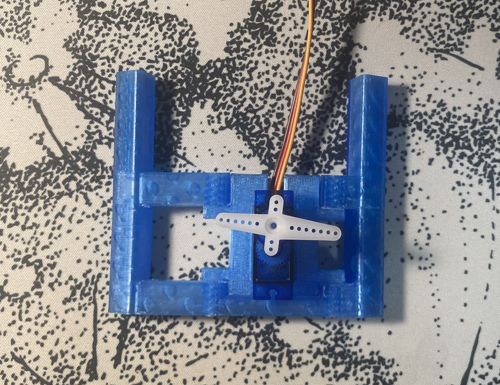

I printed a small section of the structure, which includes attachments for the rods which I plan on testing once I buy them. The bolts couldn't get in and I realized the rod attachments could flex, so I've made the necessary adjustments in the CAD model.

**Time spent: 6h**

## July 15: Adding items to my cart

Today I've added the items on AliExpress to my cart so that I can buy them when the shipping date is when I'm home.

**Time spent: 45min**

## July 21: Buying more parts

Today I've bought the carbon fiber rods, the IMU, the motors and the TVC servos.

Before buying them, I realized that the IMU had no reviews. Amazon, where I was planning to buy it, is plagued with fake MPU-9250s without magnetometers. For that reason I searched for other sellers and I found one on AliExpress with good reviews and a similar price that explicitly stated it used the original sensor with the magnetometer. I talked with my reviewer about the change, and after getting approved I bought all the parts!

**Time spent: 1h 15min**

## July 23: Attempting to buy more parts

Today I planned on buying the remaining items on AliExpress. I had already added them to my cart, and there happened to be a huge sale running that allowed me to get the LiPo charger for half the price. Now I just had to pay, or so I thought.

When I tried to pay, AliExpress declined my card for "security reasons". However it still had placed the order but I had to pay it within a certain timespan if I didn't want to get it cancelled. So I went through every one of the items and paid for them, except for the ESCs, the charger, the LiDAR and the leg springs, which I still couldn't pay. I kept trying and I eventually could pay the springs. Except because AliExpress chose to cancel my order right afterwards and now a refund will take 3 to 15 business days.

At this point it was 12PM and I decided to continue trying the day after. This meant that the order for the LiDAR would be cancelled, but that's fine as I didn't get any discounts on it. If I don't manage to pay for the charger tomorrow though I will lose $12 as I used my discount for that.

**Time spent: 1h 30min**

## July 24: Paying for the remaining parts

Today I attempted to pay for the remaining parts but it kept failing. As a last resort I called my father and we ended up opening a new PayPal account linked to the HCB card. This finally worked, and after paying for the ESCs and charger I ordered the remaining parts which I couldn't buy yesterday: the springs, the LiDAR and cables, which I couldn't add to my cart in the first place because of my order being too large.

I also noticed I had received the reimbursement from AliExpress, the one that allegedly would take 3 to 15 business days. Anyways the only things left to buy now are the propellers and the magnetic balancer. Except because I found out the store from which I was going to buy the propellers from doesn't ship anywhere at all, but that's a future me problem.

**Time spent: 1h**

## July 25: Finding new propellers

Today I wanted to buy the propellers, so I started looking for other sellers that would ship to my location. However, there weren't many as the propeller I chose is discontinued, and the only ones that I could find were way more expensive. I chose this propeller because of the availability of test data with the motors I'm using, but I started to look for other options. After some time I found out that the manufacturer of the propellers had made an updated version. Although I don't have test data for it, it should behave roughly the same. I found the propeller on Banggood at a good price, and I bought it after talking with my reviewer about the change.

**Time spent: 1h 15min**

## July 26: Buying the propeller balancer

Today I bought the propeller balancer and for once everything went according to plan. The only thing left to buy now is the PCB, which I'll do once I test the avionics.

## July 28: More parts have arrived!

Today the carbon fiber rods and the IMU have arrived!

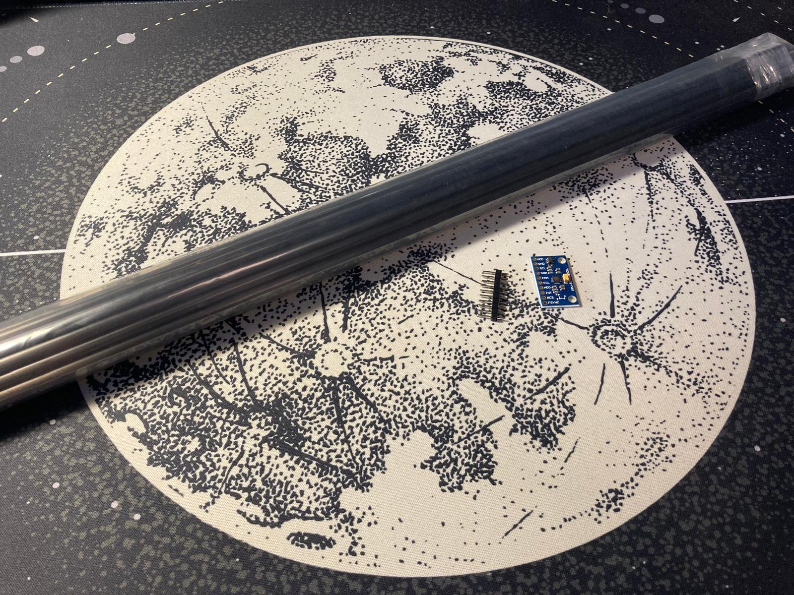

## July 29 Log 1: The whole AliExpress warehouse has arrived at my room

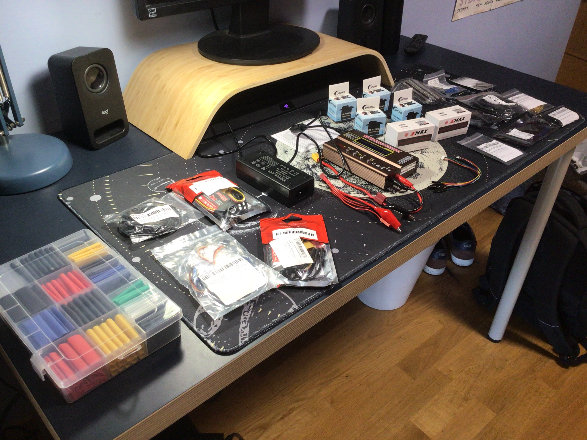

I'm not even going to try to list everything that has arrived today. It's just insane to think that I got all of this for free.

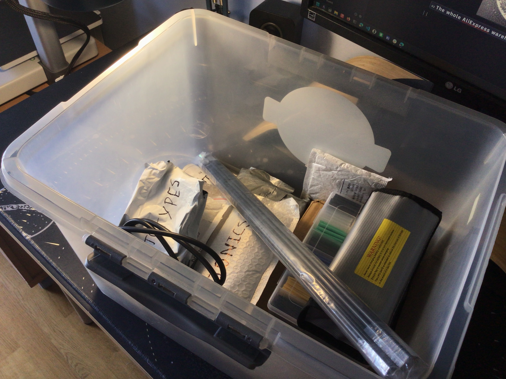

After checking that everything was in a good state (and realizing that the AC cable for the charger had the wrong plug - thankfully I had spares), I organized everything into bags with different categories and all of that went into a box for everything Starkit.

**Time spent: 2h + 2h 30min organizing the rest of my electronics**

## July 29 Log 2: Testing the ESP32

The only thing left to buy is the PCB, but before I do that I have to verify that everything works fine as it is connected in the schematic. However, I decided to test every system in the avionics separately before assembling the whole circuit.

I had only worked with Arduinos before, not ESP32s, so I started by testing uploading an sketch to the ESP32 first. I followed through a 20 minute video on how to setup PlatformIO for ESP32 development. I installed the necessary drivers and adjusted the PlatformIO project settings but nothing worked at all. I tested different cables and different sketches but still I couldn't get it to work. Then I followed through a 1 minute video on how to setup Arduino IDE for ESP32. It worked on the first try an I got an LED to blink:

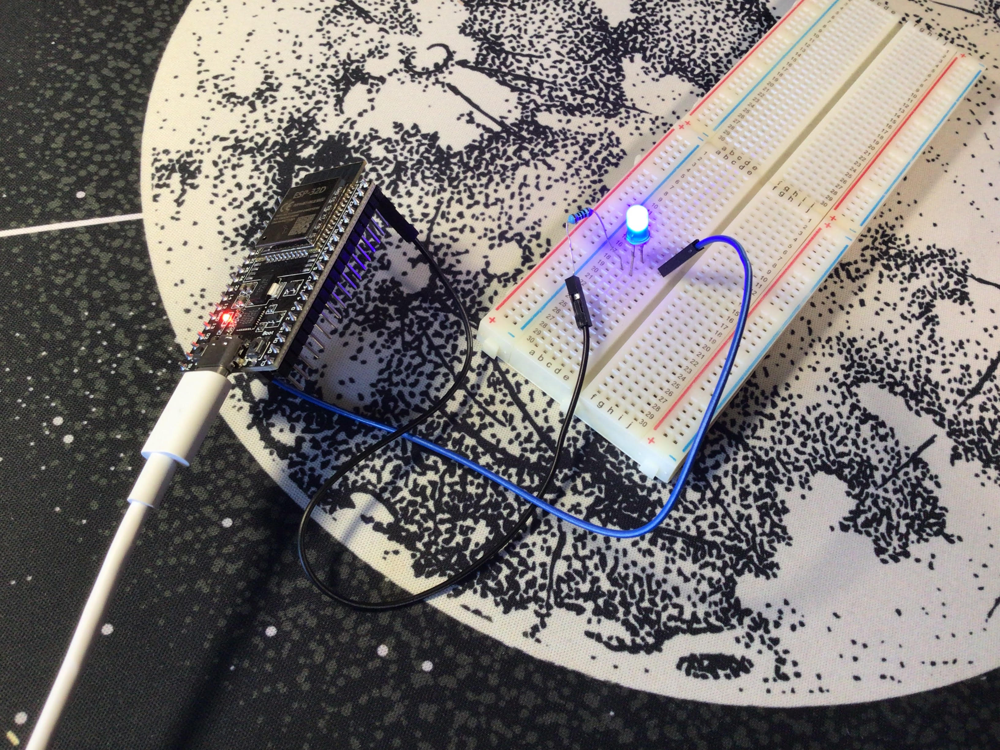

**Time spent: 1h 15min**

## July 30: Testing the LiDAR and the TVC servos

I started by testing the LiDAR with the ESP32. In the real thing, the LiDAR is powered by the BEC output of one of the ESCs. As the ESP32 is a 3V3 device, I had to use an Arduino UNO to provide the power. I made the following circuit:

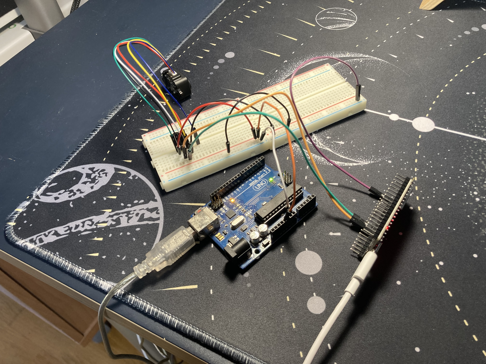

After finding the right library and tweaking it to work with an ESP32, I got it to work pretty well.

Next, I tested the TVC servos. I used the same system in which I get the power from an Arduino but all processing happens on the ESP32. I got it working in no time and I was honestly surprised with their speed. A huge upgrade over the SG90s I had always worked with.

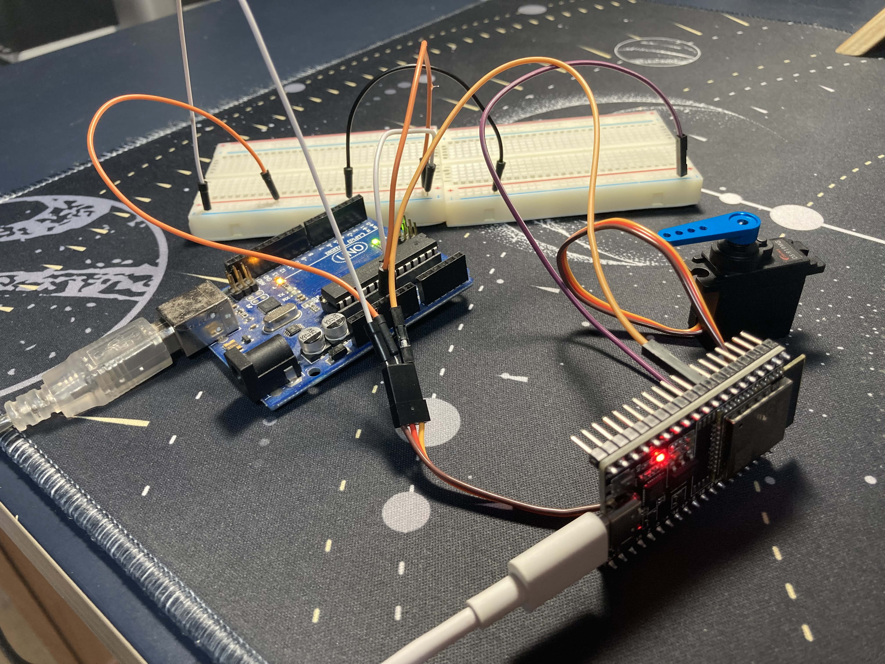

Finally, I soldered the IMU so that I can test it tomorrow.

**Time spent: 3hmin**

## July 31: Testing the IMU and the BMS

Today I wanted to test the two final subsystems of the avionics, the Inertial Measurement Unit and the Battery voltage Measurement System (get it???).

I wired the IMU up but when writing the code I realized I didn't even know what an I2C address was so I decided to do some research on how that works. And I learned that you can connect multiple devices to the same bus with only two wires. I just for some reason assumed each device needed two wires each. I decided to wire the LiDAR as well to the same bus, and after installing the necessary libraries and making the code, I got both the LiDAR and the IMU to work at the same time.

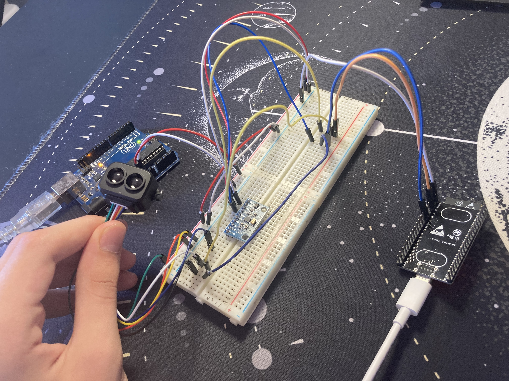

After that I installed a sensor fusion library and to my surprise it worked on the first try. It needed a bit of calibration on the raw IMU values for it not to drift over time, but the fact that I got sensor fusion to work so quickly is insane to me.

Next I updated the PCB to use a single I2C bus, as it simplifies the code, frees up pins and for my application it works the same. 

After that I tested the final subsystem, the BMS. It uses two 10kΩ resistors to divide the voltage of the first cell of each battery, so that the ESP32 can read it. After calibrating it I got it to work well at 5V and 3V3.

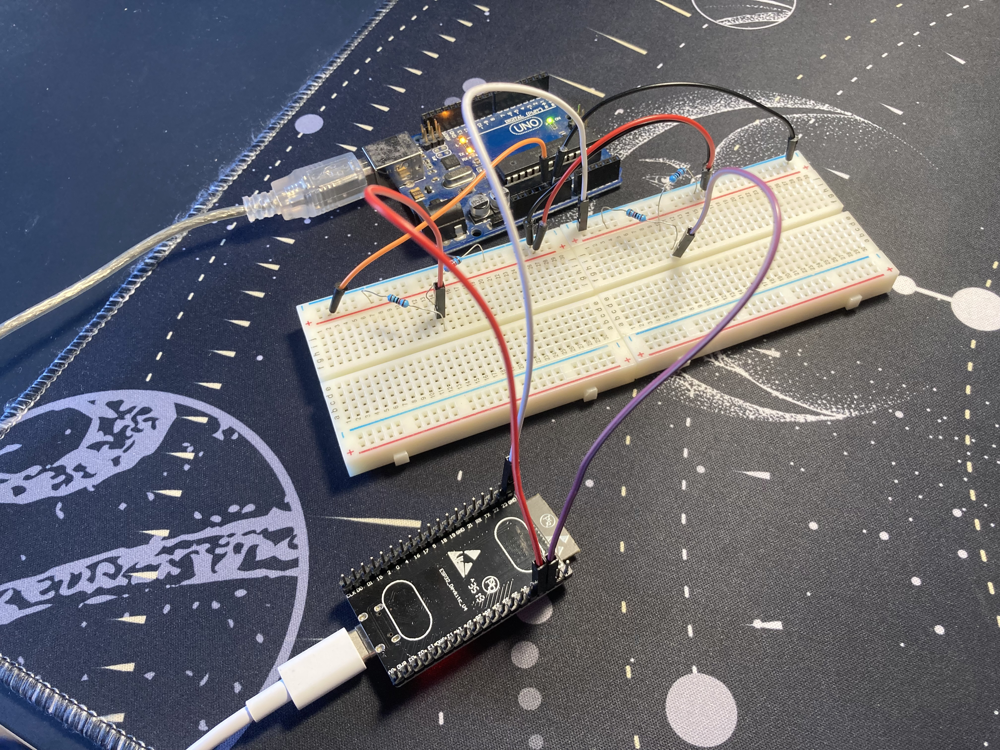

Finally I started working on making the full circuit, for which I planned to use the actual BEC outputs of the ESCs. However I forgot that without the motors connected (which I have to solder the connectors for) the ESCs can't make sounds and I can't calibrate them or configure them at different voltages. In the end I chose to not test the full circuit, as I've verified that every subsystem works and I prefer to solder the motor cables and connectors later on when the vehicle is assembled, so that I can choose the most optimal cable length.

**Time spent: 3h 30min**

## August 2 Log 1: More testing + Updating and ordering the PCB

Today I tested the LiDAR and the IMU again because I wanted to make sure that getting the data and performing sensor fusion wouldn't take over 20ms, which is the loop time the flight computer will be running at. At 400kHz of I2C clock speed it took only 2.5ms. The LiDAR allegedly only worked up to 250kHz but if it works it works.

Next, I made sure the dimensions and hole sizes for all the parts were correct on the PCB. I noticed that I had soldered the IMU headers with a slight slant so I wanted to solder the female headers on the PCB at an angle to compensate it. For that I needed to have the same hole size than in the IMU to align the headers, so I measured it on some pictures I found of the IMU and it appears to be 1.2mm.

Finally, I added the PCB to my cart on JLCPCB. I planned to buy it out of my own money, but as I updated some components and caught a discount on AliExpress I had enough money on the grant card to buy it. I talked to my reviewer about it and I got approved so I will buy it soon.

**Time spent: 3h**

## August 2 Log 2: More testing again

I realized on the rocket the LiDAR would be 50cm apart from the PCB, whereas the IMU would be mounted on it. This could cause issues when both are in the same bus, specially when running the LiDAR over its rated clock speed. I should have probably just used two buses and change the code of the libraries to work like that. Still I assembled the circuit again to test it with longer wires, and it still worked flawlessly.

**Time spent: 30min**

## August 5: Ordering the PCB

Today I ordered the PCB! Before that I changed the silkscreen slightly and I think it looks much better now.

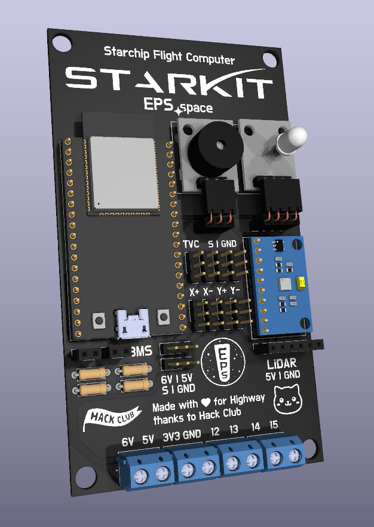

**Time spent: 30min**

## August 20: The PCB has arrived!

The PCB has arrived today! It looks so sick

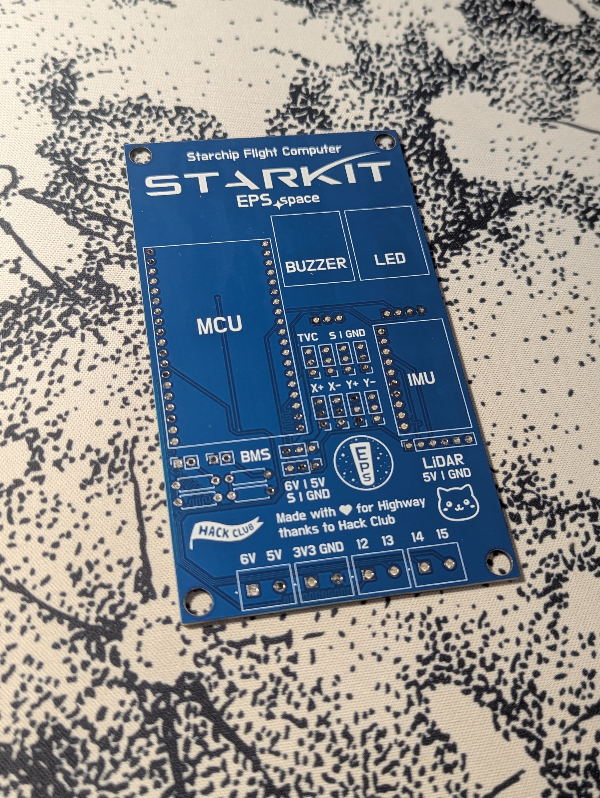

## August 22: Leg development

I've decided for my next project to be prototyping the landing legs. When making the CAD model I initially thought I could figure out how to cut the leg struts to be 45cm long, which allowed them to fit better with the deployable landing leg design. However, I decided to ditch that idea as I don't have a proper setup to cut them on. Carbon fiber can be pretty hazardous if gets into your lungs, eyes or skin, so I don't feel it would be wise to try cutting it without the necessary equipment.

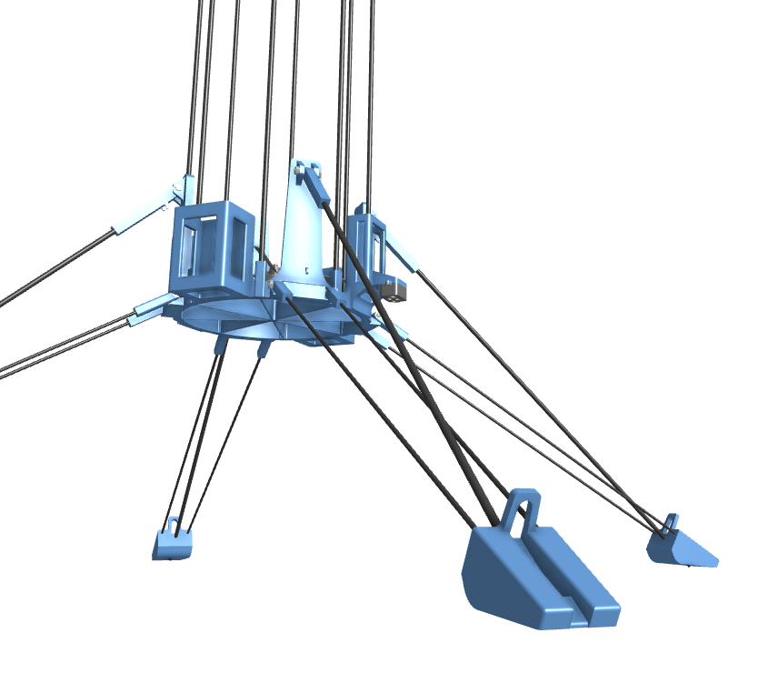

Today I changed the design to work with 50cm struts. This makes the design heavier, but I still have plenty of weight budget to work with. Next, I started printing the parts to assemble a test leg. I sent the print job, and after a bed adhesion failure and some tweaking to the slicer settings, I got the first part of the assembly printed. I had tested the tolerances for the rods, but on my new part there was no way to get the rods in. Apparently printing orientation also plays an important role on the fit. I tried making the hole larger with no success, so I'll reprint the part tomorrow.

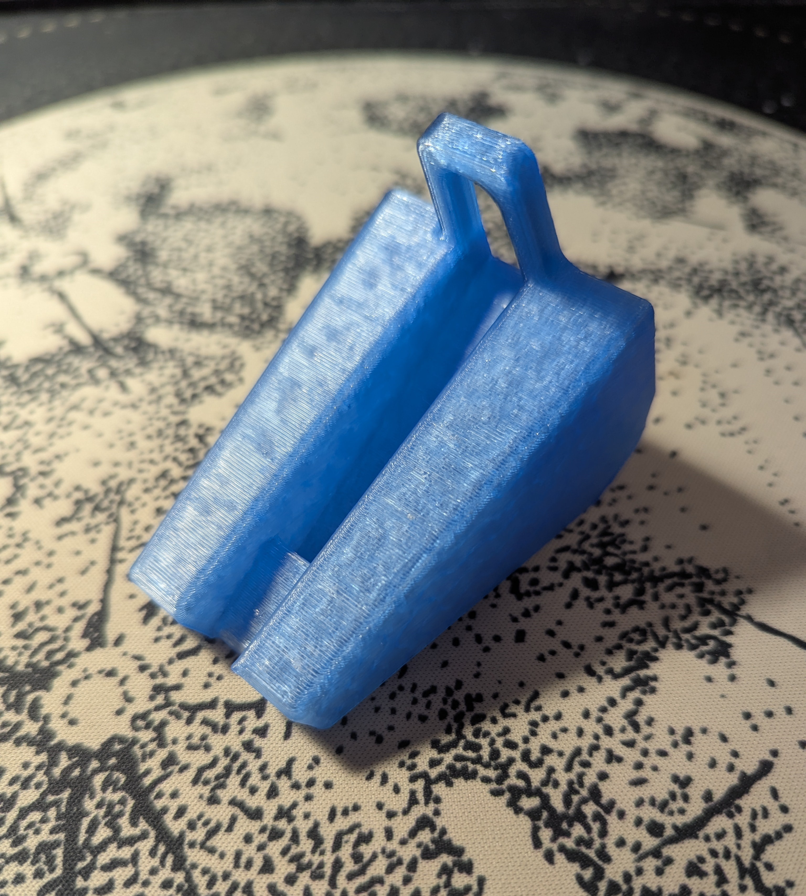

**Time spent: 2h**

## August 23: Leg development

Today I made a test piece to dial in the tolerance of the rods on that orientation. After knowing the optimal tolerance, I printed the part again. The rods got in, except because I quickly realized I had only changed one of the rods to be 50cm in the CAD model and I completely forgot that wasn't the only one I had planned on cutting.

I updated the design and printed it once again, except because only the fact that the hole was longer on the new design increased the friction enough to make fitting the rods impossible. At this point I had spent 90g of filament already so I really needed for my next attempt to go right. I dried the filament and printed more test pieces, and I think I dialed in the tolerance for this length, but I'll have to dry the filament more to get rid of all the bubbles which I think are currently preventing the rod from getting all the way through.

## August 24: Leg development

I think one of the reasons I had so much trouble yesterday is because I was constantly multitasking. When I had an issue, instead of reflecting on it I just tried random fixes and hit print, then went to work on other projects. While I might do other stuff when a part is being printed, I should have really reflected on my failures and worked on focused sessions to update the design.

Today, after drying the filament overnight, I printed more test pieces and after really making sure everything was right, I printed the full part. Except, guess what, it didn't fit yet again. For whatever reason, the same printing orientation, the same dimensions and the same slicer settings don't recreate the same hole on test pieces and on the real part. At this point I was kind of going insane so I just hit print again with more tolerance, but I paused the print at a few millimeters to test the fit before printing the full thing. Finally, after 120+ grams of filament and 2 rods that were sacrificed on test fits, I got the part to work. Going forward, having learnt how unpredictable this can be I will just make holes slightly oversized and use another locking mechanism such as hot glue, which would lock the rods firmly in place but also allows for remelting it if needed. It feels bad to have wasted so much material but at the same time the lessons I learnt cost much more than that.

After finally getting that part right, I printed the rest of parts of the assembly and the process was much more straightforward. The only thing left now is assembling everything.

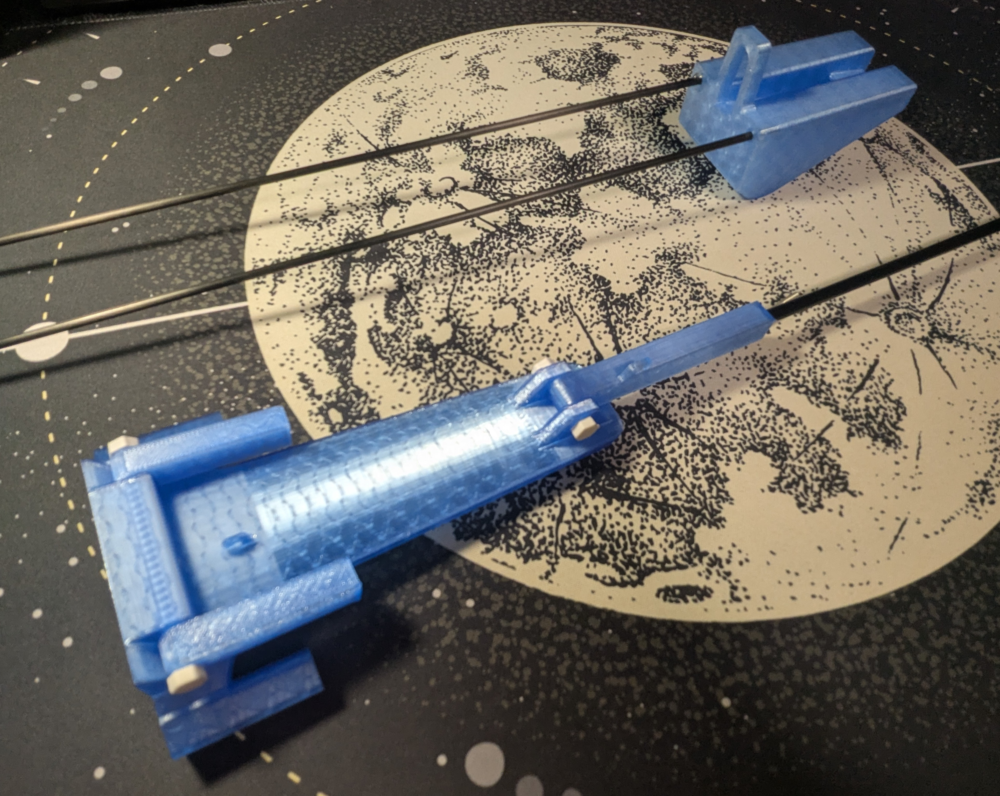

**Time spent 2h 30min**

## August 25: Assembling the landing leg + Leg deployment mechanism

Today I assembled the landing leg prototype! Everything works as expected. Next, I printed the assembly that holds the servo to control the leg deployment. I had printed this previously to test the servo mounts but I'm printing it again with the changes I implemented. With this, I made a simple circuit to control the servo and I did my first ever leg deployment test.

**Time spent: 3h**

## August 29: Fixing the leg deployment mechanism

Today I wanted to fix a problem with the leg prototype that made the leg randomly deploy at times. The servo arm that held the leg in place before deployment wasn't long enough to account for the flex of the rod, so some movements and vibrations might flex the rod enough for the leg to deploy. To fix this, I printed a part that snaps into the servo arm to extend it. After a couple iterations I got it right!

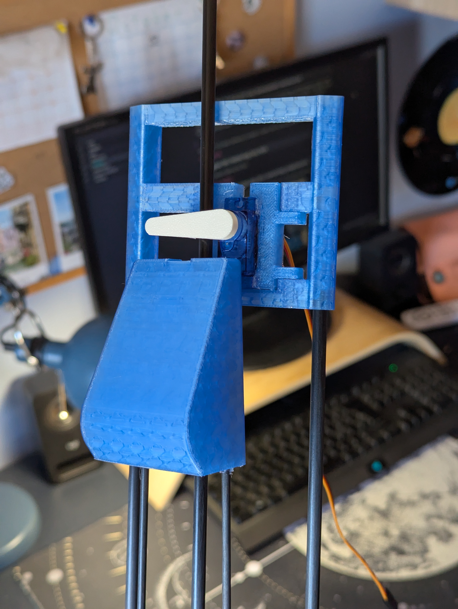

After that, I cut some connectors to length to solder them to the PCB tomorrow.

**Time spent: 4h**

## August 30: Soldering the PCB

Today I started soldering the PCB!

**Time spent: 3h 15min**

## October 2nd: Soldering the remaining components

Today I soldered the remaining components to the PCB and I'm really happy with the result!

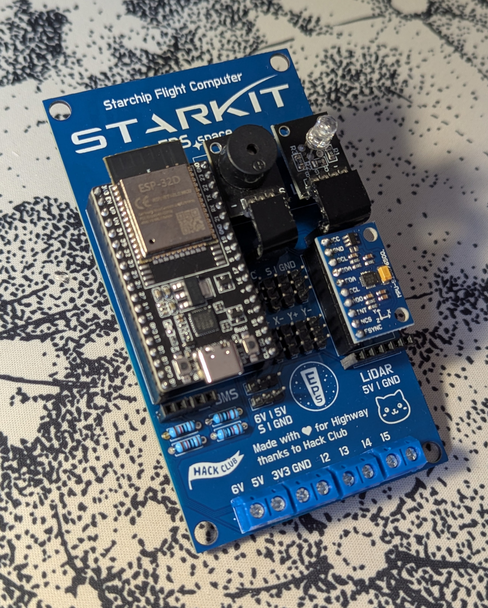

**Time spent: 2h 30min**

## October 3rd: Testing the PCB

Today I've tested all systems on the PCB except the BMS and the servos, which I will test soon. Again, I'm using an Arduino to provide the input voltage. This will be done by the ESCs on the real thing. Amazingly, everything worked flawlessly on the first try.

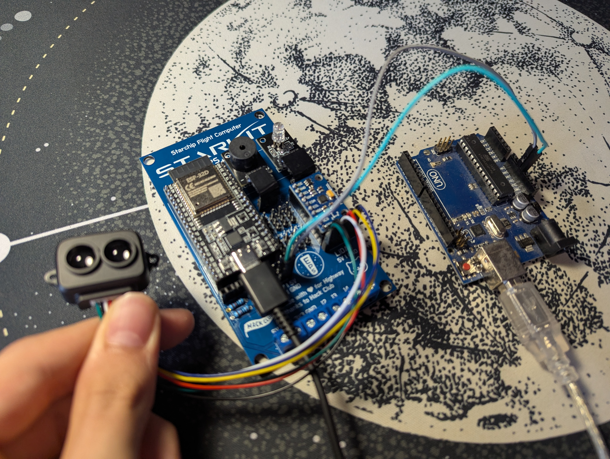

**Time spent: 1h 15min**

## October 5th: Testing the BMS and servos

Today I've tested the remaining systems on the PCB, the BMS and the servos. With this everything on the PCB is tested an I can move on to printing some more prototypes.

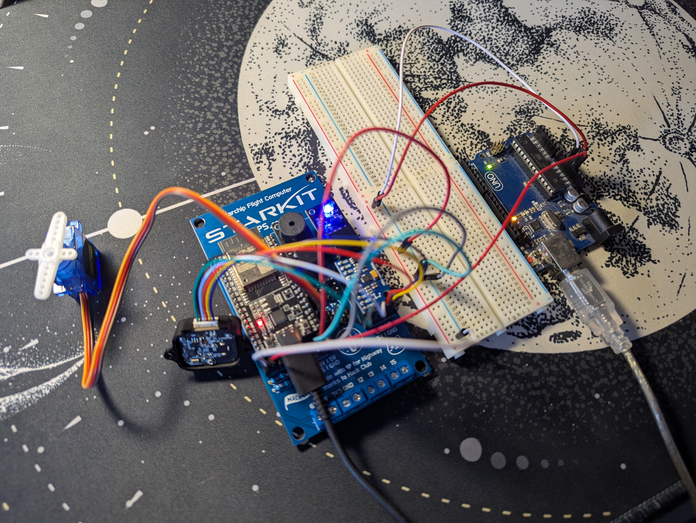
**Time spent: 1h**

## October 11th: Prototyping the battery and ESC mounts

The next thing I'm going to do is testing the battery, ESC, LiDAR and motor mounts. Today, I designed a test piece for the battery and ESC mounts. This piece also tests if the cables to connect the two are long enough, as arranged in the real thing. 

The test piece also includes two rod attachments with a new locking method that I'm testing using bolts. If this method were to be strong and reliable enough, I would use it to avoid the unpredictability of friction fits and to avoid using glue (which requires sanding the rods for strong adhesion, and I don't have the necessary equipment to do that).

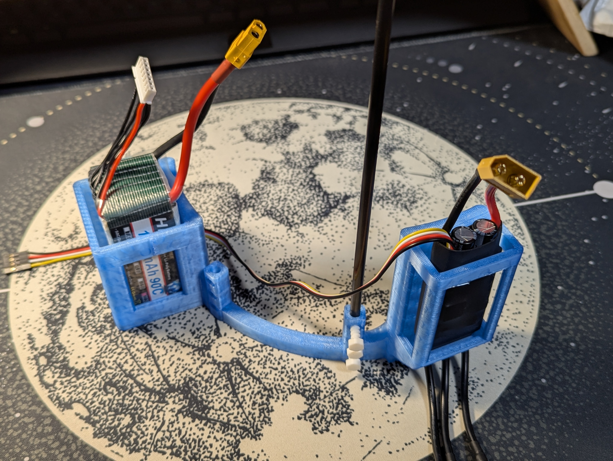

The bad news: the cables aren't long enough and I don't have enough margin to move the mounts. The fix is really easy nonetheless, I'll just have to buy an male to female adapter which will extend the cables just enough.

The good news: bolt locking the rods works like a charm! No more testing tolerances or buying expensive equipment to sand the rods. I will now update the design to use this method everywhere.

**Time spent: 2h 45min**

## October 12: CADding

Today I adjusted the CAD model with the things I learnt from yesterday's prototype. With the prototype I also realized that the propellers that I've got are slightly larger from the ones I originally planned on using, which made the margin between the propeller and the print really low. I tried to make the diameter of the rocket larger, but my CAD model broke apart.

At this point there are many changes that I want to make, such as redesigning the airflow straighteners, using foam on the landing legs to reduce vibrations, changing all rod attachments to use 0.5mm of tolerance + a bolt lock, and changing the design to use only 1 rod segment instead of 2 (this will make the rocket shorter which is generally beneficial, and the new rod locking method allows me to attach prints in the middle of rod segments instead of in between them).

It became increasingly more obvious that with the mess that my CAD structure is I wouldn't be able to do all of this, so I decided to start over. I haven't made a lot of progress so far but I have a much cleaner structure from the beginning.

I've decided to split the model on 3 modules: the propulsion module at the bottom, the guidance module at the middle and the control module at the top.


**Time spent: 2h 45min**
  
## October 15th: Progress on the propulsion module

Today I continued working on the new CAD model. First, I added attachments for the carbon fiber rods on the propulsion module:


I then added the redesigned airflow straighteners, which will hold the motor and on the new model, the LiDAR as well.


Next, I added mounts for the ESCs:


Finally, I added the battery mounts:


**Time spent: 1h**

## October 16th: Progress on the new CAD model

Today I started working on the guidance module. I've made a structure with attachments for the rods and for the PCB.


  
Next, I added attachments for the landing leg servos:


I then started the design of the control module. I've added rod attachments and mounts for the TVC servos as well.


After that, I've set up an assembly that joins all modules and the carbon fiber rods.


Next I've added attachments for the landing legs on the propulsion module:


After that, I've added an attachment for the LiDAR below the motor. This new position will make it easier to solve altitude in code, and it makes the attachment lighter as well.


Finally, I added the motor mount on the propulsion assembly and I added fillets on everything. The propulsion assembly is almost finished!


**Time spent: 2h 30min**

## October 17th: Progress on the new CAD model

Today I started by adding the motor mount on the control assembly.


Next, I added the servos for leg deployment to the guidance assembly.


I then added the TVC servos and vanes to the control assembly.


Next, I made the landing legs:


After that, I added some foam to reduce vibrations on deployment.


I then added the PCB to the guidance module.


Finally, I added rod locking bolts in the propulsion and guidance assemblies.


**Time spent: 5h 15min**

## October 19th: Polishing the new CAD model

Today I added bolts for locking the carbon fiber rods to the control module as well


After that I added drafts on airflow straighteners to strengthen their joint with the structure.


**Time spent: 30min**

## October 21st: Polishing the new CAD model

Today I added some rod locking bolts that were missing on the landing legs.


With this the new CAD model is complete!


**Time spent: 30min**

## October 24th: Designing prototypes

Today, I made some prototypes to test some parts of the new design. This prototype tests the motor mount and the LiDAR mount:


And this prototype tests the attachment for the TVC vanes:


**Time spent: 15min**

## October 25th: Prototyping

Today I printed the test pieces I had designed yesterday. The bolts for holding the motor wouldn't fit, so I adjusted the CAD model to fix that.


I also printed the piece to test the attachment for the TVC vanes and everything worked as expected.

## October 26th: Rotating LiDAR mount

Today I rotated the LiDAR sensor on the bottom because I noticed its cable to the PCB would be shorter this way.


**Time spent: 15min**

## November 1st: Weight optimizations

Today I woke up and realized that I could make a simple change on the design and save a lot of mass. First, I removed the servos for leg deployment from the guidance assembly, leaving the PCB mount only.


Next, I moved the servos for leg deployment to the control assembly.


Finally, I updated the assemblies to use the new design.


With this change, the guidance assembly weighs basically nothing, and the control assembly doesn't weigh that much more because it had already got the structure to hold servos.

At this point I'm happy with the design and I've tested and prototyped everything that I wanted to. I'm finally going to start building this thing and see how it goes!

**Time spent: 1h 30min**

---

# Building Starkit

## October 26: Printing the first module

Today I printed the first module of Starkit. After cancelling the first print early on because I had forgotten a support, I let the second print run overnight and I woke up to a beautiful first module! (I actually woke up multiple times over the night because the filament kept tangling)

With this Starkit officially goes from CAD to reality!

## October 27: Post processing and assembly

Today I removed all support material from the module and assembled a mock up to see how the rocket will look. I'm so excited this is finally becoming real!


**Time spent: 30min**

## November 6th

20 min

19 55 to 21 15ish

+15min ish

Printing and assembling bolts + coding flight software (reading sensors)

## November 7th

Coding, check hackatime -> pid works and actuates motors

## November 8th

